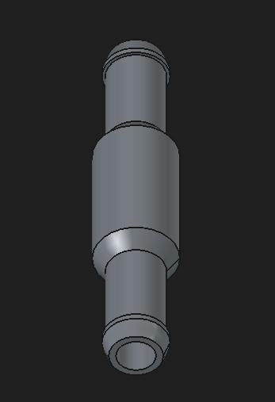
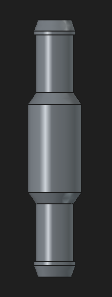

# PCV restrictor

The restrictor uses a short metering throat with interchangeable 2, 3 and 4 mm variants. The design files include native FreeCAD 1.1.1 CAD, three 3MF files and two model views; provenance is documented in the [import record](import-2026-10-05.md). An initial QIDI PAHT-CF print is reported; alternate variants are described inconsistently as printed and planned/printed, so their physical completion and measured bores remain unconfirmed.

See [A04: PCV system overview](../../hardware/architecture/pcv-system.md) for the restrictor between the proposed pressure tap and intake-vacuum return.

## Imported files

| Artifact | Purpose |
| --- | --- |
| [source/pcv-restrictor.FCStd](source/pcv-restrictor.FCStd) | Authoritative native model, currently 3 mm; editable feature tree |
| [printing/pcv-restrictor-2mm.3mf](printing/pcv-restrictor-2mm.3mf) | FreeCAD mesh export in millimeters; no slicer profile supplied |
| [printing/pcv-restrictor-3mm.3mf](printing/pcv-restrictor-3mm.3mf) | QIDI Studio project with 3 mm mesh and print settings |
| [printing/pcv-restrictor-4mm.3mf](printing/pcv-restrictor-4mm.3mf) | QIDI Studio project with 4 mm mesh and print settings |
| [Import record](import-2026-10-05.md) | Provenance, sanitization, validation, and evidence limits |

No STL or STEP exports were supplied or generated. Separate native source revisions for the 2 and 4 mm exports were not supplied. Public filenames use kebab-case; geometry and slicer settings were preserved.

## Adopted CAD design

The supplied native CAD geometry defines the current prototype design. It supersedes the earlier written dimensional targets; the comparison below retains those targets only as design history. Physical fit, durability and flow performance remain to be tested.

The supplied native model differs from the [historical context](../../docs/LS_PCV_SYSTEM_CONTEXT.md) and accompanying prose notes. These are native dimensions inspected in FreeCAD 1.1.1, not as-built measurements. Mesh inspection agrees apart from intentional metering variants and mesh approximation. All dimensions are in mm.

| Feature | Adopted CAD geometry | Superseded written target |
| --- | ---: | ---: |
| Metering ID | 3.0 native; 2.0 / 3.0 / 4.0 meshes | 3.0 baseline |
| Straight metering length | 3.0 | 3.0 |
| Overall length | 67.0 | Not specified |
| Maximum body OD | 14.0 | 14.0 |
| Main / barb straight passage ID | 6.4 | 8.0 main / 6.0 barb |
| Internal taper into throat | 8.0 long, 6.4 to metering ID | 6-8 long, 8 to 3 ID |
| Internal taper out of throat | 8.0 long, metering ID to 6.4 | 15 long, 3 to 8 ID |
| Separate 8 to 6 ID transition | Not present | 4-5 long |
| Barb root OD | 9.8 | 9.8 |
| Retention crest OD | 10.9 | Approximately 10.5 |
| Tip OD | Approximately 8.716 | Approximately 8.8-9.0 |
| Tip taper length | 3.0 | 3-4 |
| Straight root/clamp section | 15.0 each end | Clamp land approximately 8-10 |
| Tip-to-body-taper axial span | 19.0 each end; not measured hose engagement | Engagement approximately 16-18 |
| External body-to-root taper length | 3.0 each end | Approximately 7-8 |

Target hose ID is 3/8 in (9.525 mm). Compare 2.0, 3.0, and 4.0 mm metering variants; 2.5 and 3.5 mm may follow if measurements justify them.

## Design intent

### What the restriction changes

A **fixed restrictor** limits flow through a small passage rather than actively controlling a pressure setpoint. In this PCV system, the intake-vacuum path draws through the restrictor while blow-by and the fresh-air path affect crankcase pressure. The measured pressure is therefore a result of the whole system, not a pressure value assigned by the bore diameter.

The metering throat is the narrow passage that provides the intended restriction. Changing its diameter gives a repeatable design variable to compare on the bench and vehicle. Doubling a circular bore's diameter multiplies its area by four; that does not guarantee four times the flow, because pressure difference, passage geometry and gas behavior also matter. The adopted area calculations below explain why small diameter changes deserve measurement.

The catch can and restrictor have separate jobs: the can is intended to collect entrained liquid before the intake return, while the restrictor meters that return path. A clean-looking can, a modeled bore or an atmospheric zero reading alone does not establish the final PCV performance. Use the [test plan](../../docs/testing/test-plan.md) to compare actual configurations.

### Adopted prototype

The short metering section localizes restriction. The adopted internal tapers are symmetric: each is 8 mm long between the 6.4 mm passage and the metering throat. The earlier 15 mm diffuser and separate 8-to-6 mm passage transition are superseded proposals. The 3 mm throat is the initial tuning baseline, with 2 and 4 mm comparison variants; final sizing remains subject to measurements.

The actual 6.4 mm bore and 9.8 mm root OD leave nominal radial wall thickness `(9.8 - 6.4) / 2 = 1.7 mm`. This is a geometric calculation, not a strength or flow validation. Orifice areas are approximately 3.14, 7.07, and 12.57 mm² for 2, 3, and 4 mm respectively; area ratios alone do not establish actual flow.

The baseline material is QIDI PAHT-CF. Reported print orientation is vertical with the fitting axis along Z; keep support out of the passage. Inspect passages, hose-entry edges, and layer integrity. Record actual bore measurements and any finishing operation; a nominal filename does not establish the finished orifice diameter.

## Printing projects

The 3 and 4 mm projects identify QIDI Studio `02.07.02.60`, an X-Plus 4 printer, 0.4 mm nozzle, 0.2 mm layer height, and the `QIDI PAHT-CF @Qidi X-Plus 4 0.4 nozzle` filament profile. These are saved settings, not verified print-history records or universal printing recommendations. Slicer opening and slicing were not performed during import. Material suitability, finished bore, hose retention, sealing, and heat/vibration durability still require physical validation.

## CAD views

These are supplied model views, not photographs of printed parts; internal dimensions cannot be established from them alone.

## Validation and further exports

Original and sanitized native files opened and fully recomputed in FreeCAD 1.1.1 with one valid solid and unchanged volume. All three meshes have valid indices and each undirected edge shared by two triangles. These checks do not establish physical suitability or constitute a full mesh self-intersection/slicer validation.

For future exports, record source revision, variant, units, application version, and tessellation settings. Export tessellation settings and exact source-to-export revision history were not supplied for this batch. Do not label these prototypes as validated releases.

Compare configurations using the [test plan](../../docs/testing/test-plan.md).
