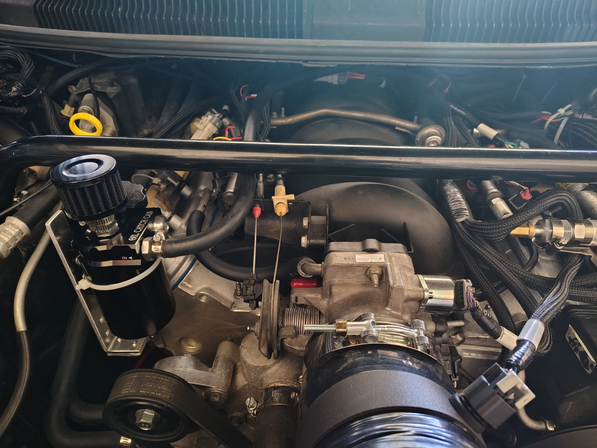
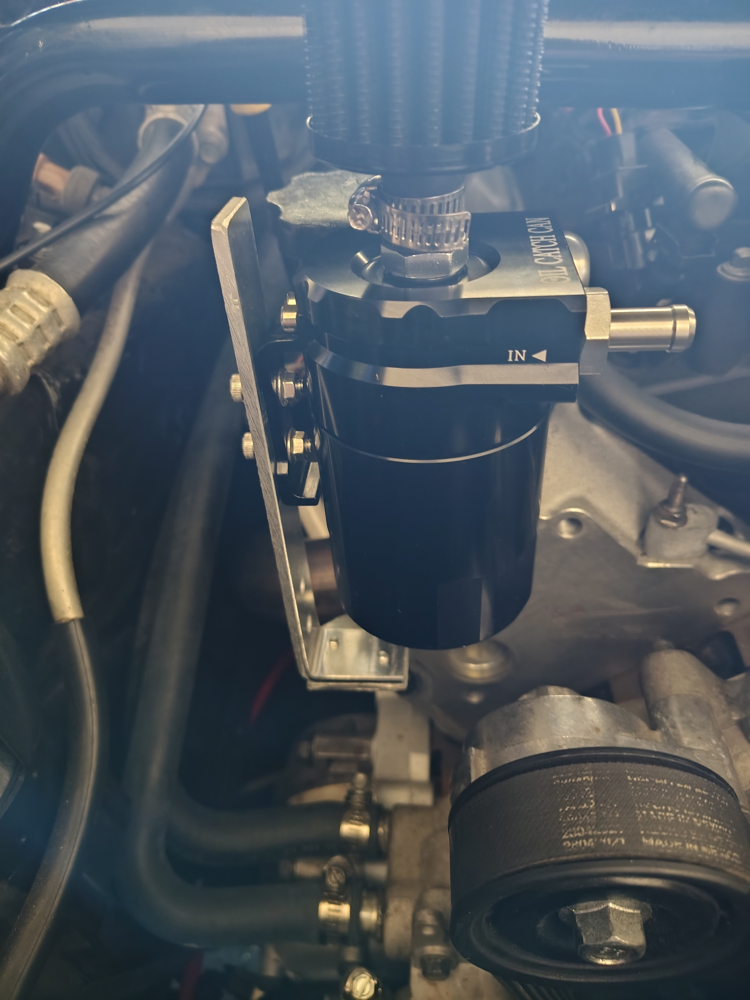
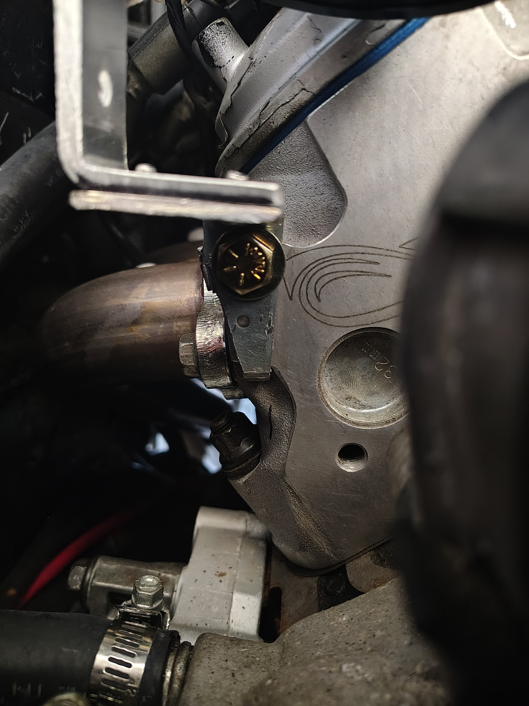
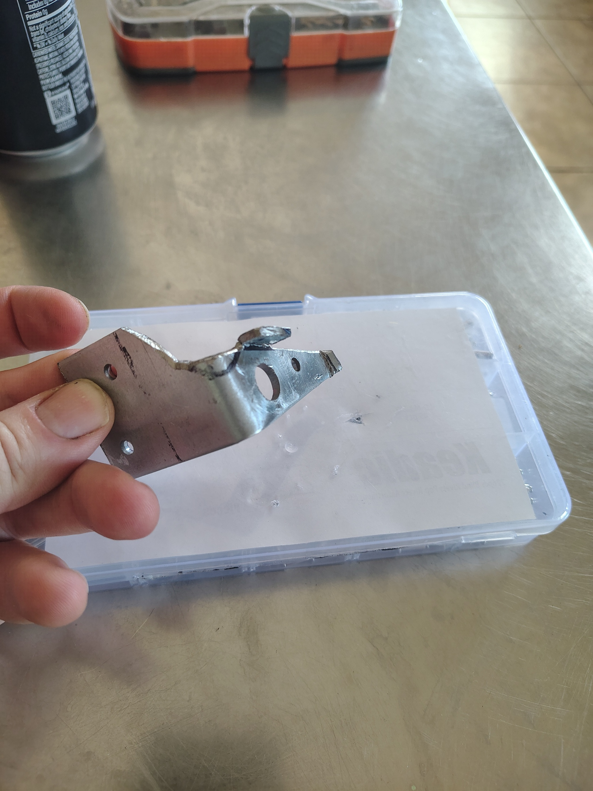
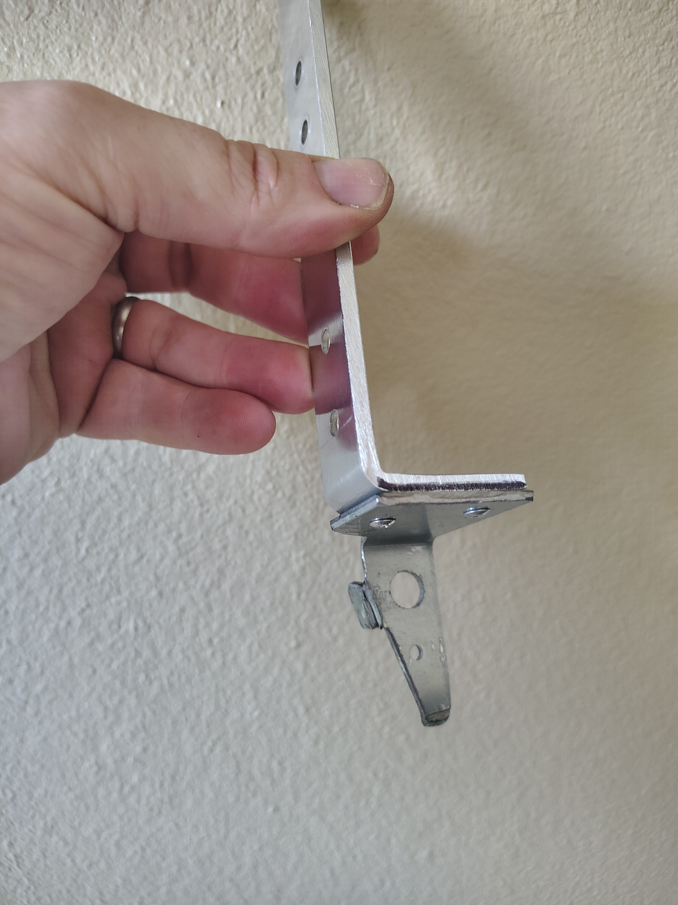

# Temporary vented catch-can installation - 2026-09-13

## Timeline and scope

This was an earlier project, completed before creation of this repository. There was **no catch can in the original September 6 planning state**. The September 13 installation introduced a temporary vented can; it did not complete the manifold-vacuum PCV system now being developed.

The September 6 project notes describe a connected passenger-front fresh-air hose, a capped driver-rear crankcase outlet, and a capped suspected manifold-vacuum connection. No rear passenger-side valve-cover port was found. Port identity and final routing still require verification; the earlier context's generic description of capped rear ports was too broad.

## Reported installation

- EVIL ENERGY 300 ml baffled catch can with top breather; purchase notes identify product B087LZHFGC.
- Custom bracket on the front of the passenger-side cylinder head, using aluminum angle and a fabricated steel mounting piece.
- M10 x 1.5 steel bolt and washer into the aluminum head, with Permatex Seal+Lock compound, as reported in the installation note.
- Two reported 3.5 mm pop rivets joining the catch-can bracket to the custom mount.
- Vent-to-atmosphere operation: crankcase vapor enters the can and exits through the top filter. Manifold vacuum was not connected.

These are installation observations, not a torque specification, validated structural design, or confirmation of final hose/port assignments. The mounting-detail photo has an unattached inlet hose barb; it documents assembly rather than a complete running configuration.

## Initial observations and follow-up

The installation notes report approximately ten minutes of idle with a few revs, light wispy vapor from the breather, and no visible oil discharge or heavy smoke. No crankcase pressure was measured, so these observations do not establish adequate pressure control, relief capacity, or engine condition.

The note called for inspecting the bracket/rivets after heat cycles, monitoring can contents, checking oil-cap sealing, and measuring crankcase pressure after completing the vacuum circuit. Those checks remain unverified here.

At that time, an Improved Racing FO-06R restrictor and an ADD W1 check valve were being considered. They were not reported installed. The later project baseline is a custom printed 3 mm restrictor and a separately evaluated low-pressure relief path; historical purchase ideas do not supersede the current BOM.

## Photographs

Public copies retain the photographed content with embedded metadata removed. Four portrait photos had EXIF orientation applied to their pixels and were re-encoded as high-quality JPEGs; the landscape installation photo was stripped without recompression. No visual redactions or generative edits were applied.

## Import provenance and limits

Imported from supplied batch `2026-09-06-pcv`: planning notes, a dated September 13 installation note, and five installation photographs. The folder date indicates planning; the installation date comes from the note, not an asserted camera timestamp. Originals remain in private local staging. One public filename corrects `peice` to `piece`.

The public record omits exact vehicle mileage, purchase transaction details, private log/tune identifiers and paths, URL tracking parameters, and unrelated discussion. Downloaded vendor product images remain private; they are unnecessary to document this installation. No faces, plates, addresses, or other obvious personal identifiers were observed in the five selected photos.

The planning notes also report a prior warm-idle log analysis supporting the 3 mm starting point. Its underlying logs were not supplied in this batch, so those statistics are not imported as verified measurements. General break-in advice and supplier availability claims from the older notes are not adopted as current guidance.

See the [current BOM](../../hardware/bom/parts.md), [project status](../status.md), and [test plan](../testing/test-plan.md) for ongoing work.
