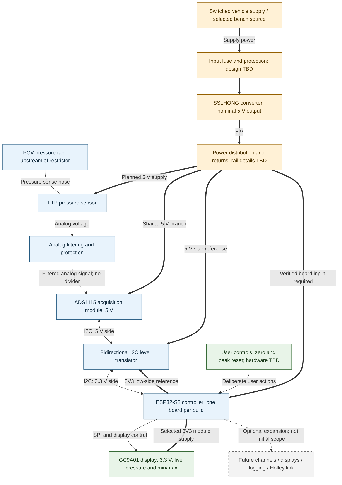

# Overall gauge architecture

A01 describes the planned single-channel, single-display gauge and its bench and XIAO controller variants. The embedded Mermaid is the conceptual source. Module interfaces and electrical validation remain pending.

## System boundaries



**Legend:** solid thin arrows are signals; the bidirectional arrow is the I2C interface; the line without an arrow is pressure sensing; thick arrows are conceptual power paths; the dashed arrow denotes optional future scope. Every path is planned. Arrow styles distinguish function, not evidence quality. The distribution block includes supply/return planning; separate ground wires and connector pins are not shown.

## Controller variants and first-build scope

Use one controller per build: the **ESP32-S3 N16R8 development board** for initial bench work, or the **Seeed Studio XIAO ESP32-S3** for the intended finished gauge and a matching bench configuration. These are alternative implementations of the controller block, not two processors connected together. Board-specific power inputs, GPIOs and firmware configuration must be documented separately. See [gauge electronics](../components/gauge-electronics/README.md).

Start with one FTP sensor, one ADS1115 module and one 1.28-inch GC9A01 display. Firmware converts readings using measured calibration, maintains signed pressure and independent positive/negative peaks, and renders live and min/max values in inH2O. Negative pressure means vacuum. Acquisition and peak capture remain independent of display smoothing. Invalid readings/calibration should be visible rather than presented as zero.

User controls provide deliberate atmospheric zero and peak reset; count, type and pin assignments are TBD. Zero requires the pressure port to be equalized to atmosphere and must not happen automatically with the engine running. No firmware or control hardware is implemented by this diagram. See [firmware requirements](../../firmware/README.md).

## Interfaces and unresolved decisions

| Boundary | Current intent | Still to establish |
| --- | --- | --- |
| PCV to sensor | Proposed tap at catch-can outlet before restrictor, as shown in [A04](pcv-system.md) | Physical tap, sense hose, mount/adapter, liquid protection and pressure difference from crankcase |
| Sensor to conditioning | Analog signal from the selected FTP sensor; planned 5 V sensor supply | Actual pinout, range, reference arrangement and calibration |
| Conditioning to ADC | Built 470 ohm / 1 uF RC filter ahead of 5 V ADS1115 A0; no divider | Actual stock parts, loading/response, power/fault behavior and input limits; [component guide](../components/rc-input-filter/README.md) |
| ADC to controller | I2C through translator: ADC at 5 V, ESP32 side at 3.3 V | hiBCTR BSS138 selected; actual pull-ups/bus checks, address, GPIOs and conversion rate pending; +/-6.144 V selected |
| Controller to display | SPI plus module control signals | 3.3 V VCC/logic selected from listing; GPIOs, current/backlight, driver and readability |
| Controls to controller | Deliberate zero and peak reset | Button count/type, wiring, debounce and interaction design |
| Power to electronics | Converter output feeds the planned gauge supply arrangement | Fuse/protection, rail generation/capacity, returns, grounding and load budget |

The [ADC notes](../components/adc/README.md) contain preliminary conditioning values, not a final schematic. This diagram deliberately shows the conditioning boundary rather than implying a direct sensor-to-ADC connection. [P04](../pinouts/ftp-sensor.md) supplies an adopted family terminal map; the measured transfer curve remains calibration work.

## Power scope

The selected [SSLHONG converter](../components/gauge-power-supply/README.md) supplies the nominal 5 V system for vehicle/converter operation. The FTP sensor and ADS1115 share that regulated branch. The ESP32's 3V3 output supplies the translator low-side reference and compatible peripherals; the translator high side uses the shared 5 V domain. This replaces the former 3V3 ADC arrangement. The [hiBCTR BSS138 module](../components/i2c-level-shifter/README.md) is selected; physical bus checks and rail capacity remain to be established; display VCC is selected at 3.3 V (Q31), with current/backlight behavior remaining to check.

A selected bench source can exercise the converter path shown here. W01 selects native USB for programming/debugging and single-source power with IN-OUT closed and USB-OTG open; simultaneous USB/converter power remains unresolved; this overview does not authorize connecting USB and converter power together. Power/ground connections for any active conditioning or controls will depend on their final circuits. [A02: power architecture](power-system.md) expands supply modes, rail responsibilities and return references.

## Future scope and validation

Additional conditioned sensors, displays, logging and a possible digital Holley interface remain optional. No expansion wiring, spare-pin assignment or timing capacity is established here. [A03: pressure measurement signal chain](measurement-system.md) expands calibration, validity handling and the separate peak/display paths. Detailed firmware and wiring remain separate work.

Before physical assembly, verify the component interfaces and power arrangement, then create the selected harness and follow the [test plan](../../docs/testing/test-plan.md). No bench or vehicle verification is claimed. Track further diagram selection in the [inventory](../DIAGRAMS.md).

## Diagram validation

Rendered and visually reviewed with Mermaid CLI 12.0.0 and Node 24.15.0. Checked label readability, signal/power distinction, branch routing and absence of clipping. This is presentation validation only. The preview remains private scratch output; the embedded Mermaid is the published source.

To reproduce, extract the Mermaid block to `gauge-system.mmd` in a scratch directory and run:

```powershell
npx.cmd --yes --package @mermaid-js/mermaid-cli@12.0.0 mmdc -i gauge-system.mmd -o gauge-system.png --size 2000 -b white
```
