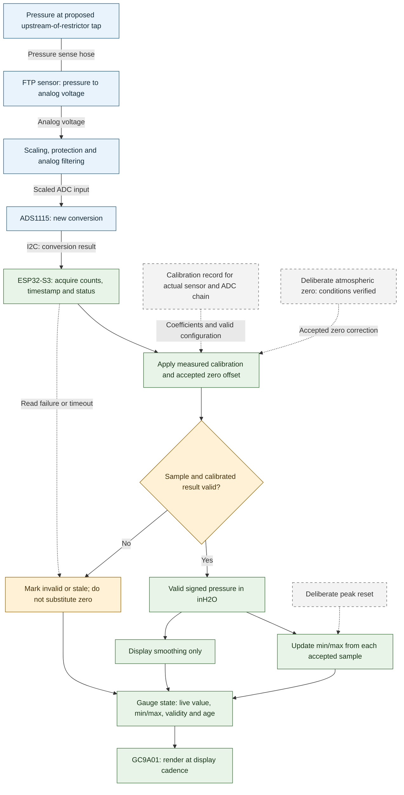

# Pressure measurement signal chain

A03 describes the planned pressure measurement chain, from the FTP sensor through calibration, peak capture and display. It applies to either selected ESP32-S3 board. The embedded Mermaid defines measurement responsibilities; firmware implementation and physical validation remain pending.

## From pressure to indication



**Legend:** solid arrows carry signals or derived data; the solid line without an arrow is pressure sensing; dashed arrows are configuration, user actions or an exceptional acquisition path. The validity diamond is a processing decision, not a pressure alarm threshold. Every block is planned. Physical and software boundaries are functional, not thread/task assignments.

## Measurement boundary and supplies

The [PCV overview (A04)](pcv-system.md) proposes sensing the catch-can outlet line before the restrictor. This measures pressure at the tap relative to atmosphere, not intake manifold pressure. Hose/catch-can losses may separate tap pressure from actual crankcase pressure; sensor mounting and this difference need evaluation. No second pressure sensor is selected here.

The [overall gauge architecture (A01)](gauge-system.md) supplies system context. Per [A02](power-system.md), use the controller board's selected `3V3` output for the ADS1115 and compatible peripherals; the FTP sensor remains planned for 5 V. Actual module compatibility, supply performance and available current still need verification. Analog scaling/protection must be resolved before connecting the sensor signal to the ADC.

## Stage responsibilities

| Stage | Preserve or produce | Decision / evidence still needed |
| --- | --- | --- |
| Pressure sense and FTP sensor | Pressure-relative-to-atmosphere signal | Actual sensor terminals, reference arrangement, range, mounting and pneumatic response |
| Analog conditioning | Scaled voltage with controlled filtering/protection | Final values, loading, tolerances, fault behavior and settling; preliminary values are in the [ADC notes](../components/adc/README.md) |
| ADS1115 conversion | New raw conversion counts | Chip/module identity, channel, gain, mode, address and supported conversion rate |
| Acquisition | Counts, sample timestamp/age and acquisition status | Readiness detection, timeouts and measured effective sample cadence |
| Calibration | Signed inH2O using an identified calibration record and accepted zero correction | Measured transfer model, coefficient units, validity range and matching hardware/configuration |
| Validity handling | Accepted result or explicit invalid/stale state | Testable limits and fault detection; no invented numeric thresholds |
| Peak path | Lowest and highest accepted pressure since the chosen reset boundary | Reset/initialization policy, persistence and measured response |
| Display path | Smoothed live indication plus independent min/max and status | Smoothing method and display cadence/readability |

Input checks occur before conversion as needed; the single validity diamond summarizes checks across acquisition, calibration and the resulting pressure. Missing/mismatched calibration, failed reads and stale samples must not become valid numbers. Detection of every physical fault is not guaranteed by this diagram: disconnected sensors or implausible values require an actual detection design and tests.

## Calibration and zero

Calibrate the complete sensor/conditioning/ADC chain against a known pressure reference. A fitted conversion may map raw counts directly to pressure; this diagram does not require reconstructing sensor voltage as an intermediate step or assume a generic OE transfer curve. Preserve raw readings and the model/configuration under the [data conventions](../../data/README.md).

If voltage columns are recorded, distinguish ADC input voltage from sensor voltage reconstructed with the divider ratio. Those are calculated values unless independently measured. Do not apply the divider correction twice when calibration already maps the assembled chain's counts to pressure.

Atmospheric zero is a deliberate operation with the pressure port equalized to atmosphere. Never automatically zero while the engine runs or treat a running average as atmosphere. Zero correction cannot replace slope/range calibration or repair an invalid sensor. The diagram shows an accepted offset, not a chosen button count or automatic acceptance algorithm.

When calibration or zero changes, existing peaks may no longer be comparable. Reset, rebase from preserved raw data, or retain them under their prior calibration identity only through an explicitly chosen policy; that policy and persistence remain TBD. Peak reset is a separate user action from atmospheric zero.

## Timing, smoothing and faults

Use each new accepted conversion for peak tracking before display-only smoothing. Do not sample only when the screen refreshes, count repeated reads of the same conversion as new samples, or let drawing operations silently reduce acquisition cadence. Specific scheduling, buffering and task structure belong to future firmware design.

The [ADC plan](../components/adc/README.md) records provisional acquisition and display-rate goals. A supported ADS1115 rate and actual throughput must be selected/measured together; no timing guarantee is established here. Pneumatic response, sensor response, analog filtering and ADC conversion already limit bandwidth before software sees a reading. Bypassing display smoothing does not imply every physical pressure spike is captured.

Invalid or stale samples do not update valid live pressure or min/max. Show validity/age explicitly; any retained last-good value must be identified as such. Retained peaks describe valid samples only and do not prove coverage during a fault interval. Initialize peaks from an accepted sample rather than inventing a zero reading. Exact stale limits, fault recovery, reset behavior and alarm thresholds remain design tasks.

## Validation and next work

Use the [test plan](../../docs/testing/test-plan.md) to establish sensor zero/slope/repeatability and test the full chain. Future checks should cover sign, units, calibration/configuration mismatch, deliberate zero/reset, stale/failed acquisition, peak preservation during display smoothing, and response to known pressure changes. Keep actual measurements distinct from expected behavior.

See [firmware requirements](../../firmware/README.md) for implementation boundaries. No firmware, calibration coefficients, numeric validity thresholds or measured response results were created with A03. Choose further work through the [inventory](../DIAGRAMS.md).

## Diagram validation

Rendered and visually reviewed with Mermaid CLI 12.0.0 and Node 24.15.0. Checked labels, validity branches, zero/reset inputs and the separate peak/display paths; no clipping was observed. This validates presentation only. The preview remains private scratch output; the embedded Mermaid is the published source.

To reproduce, extract the Mermaid block to `measurement-system.mmd` in a scratch directory and run:

```powershell
npx.cmd --yes --package @mermaid-js/mermaid-cli@12.0.0 mmdc -i measurement-system.mmd -o measurement-system.png --size 2200 -b white
```
