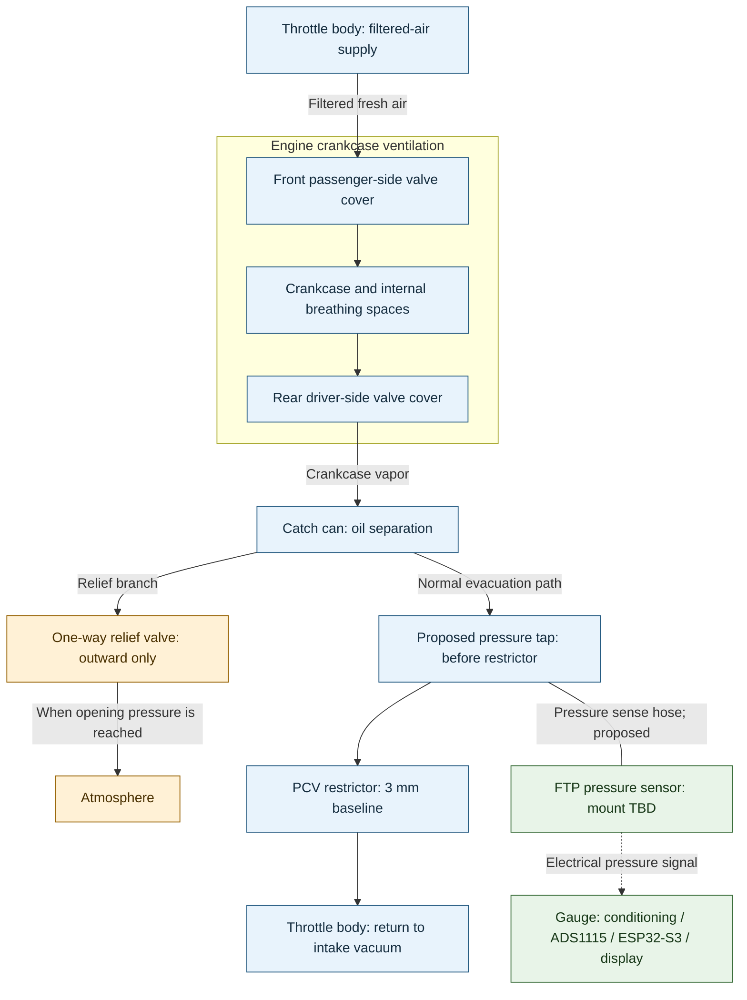

# Engine PCV system overview

A04 describes the planned PCV flow and instrumentation for the 408 CID LS project with the adopted restrictor prototype. Exact ports and physical sensor mounting remain unresolved. The embedded Mermaid is the conceptual source; installation history is recorded separately.

## Intended flow and instrumentation



**Legend:** solid arrows show intended gas flow; the solid line without an arrow is a pressure-sensing branch, not a continuous vent; the dashed arrow is an electrical signal. All connections are planned. Colors group functions and do not indicate verification. Driver/passenger and front/rear refer to vehicle orientation, not page position. This is a functional overview, not a physical layout or wiring diagram.

## Routing and operating intent

In the planned flow, filtered air from the throttle-body area enters the front passenger-side valve cover, passes through the engine's internal breathing spaces, and exits the rear driver-side valve cover into the catch can. The can has an outward-only atmospheric relief branch and an evacuation branch through the restrictor returning to the intake through a throttle-body connection.

The two throttle-body nodes represent different functions, not a shared port. Confirm the exact fittings and that the return communicates with manifold vacuum while the fresh-air connection supplies filtered air. The drawing is not a section view of the engine or proof of flow under every operating condition.

The relief branch is intended to open only when can pressure exceeds atmospheric pressure by the valve's opening differential; it is not a continuously open breather. Its actual opening/reseating behavior and reverse sealing remain unverified. See the [relief record](../components/check-valve-relief-valve/README.md). The [adopted restrictor](../../cad/pcv-restrictor/README.md) provides the 3 mm starting point, with 2 and 4 mm comparison variants.

## Proposed pressure sensing and gauge location

Show one [FTP pressure sensor](../components/fuel-tank-pressure-sensor/README.md), sensing the catch-can outlet line upstream of the restrictor through a tee or equivalent pressure port. This is a proposed implementation of the existing upstream-of-restrictor measurement requirement; the tee/port and physical sensor mount remain to be selected.

The measurement is pressure at that tap, relative to atmosphere, displayed in inH2O with negative values indicating vacuum. It is a proxy for crankcase pressure: losses through the hose and catch can may cause a difference that needs assessment. No sensor belongs on the intake-vacuum side of the restrictor for this intended measurement.

Mounting bracket, adapter, sense-hose routing and protection from collected liquid remain TBD. Preserve the sensor's atmospheric reference as required by documentation for the actual sensor. No additional pressure or temperature sensors are selected by this diagram.

The gauge is a functional destination, with its exact driver-visible mounting location TBD. Its single block includes [conditioning and ADS1115](../components/adc/README.md), the [ESP32-S3 controller and GC9A01 display](../components/gauge-electronics/README.md). The [overall gauge architecture (A01)](gauge-system.md) expands this block. Detailed power distribution and exact electrical connections are deferred to their selected architecture/interface artifacts.

## Remaining decisions and evidence

- Confirm throttle-body port identities, catch-can port assignments, fittings, hose sizes and final routing.
- Review the proposed upstream pressure tap and choose the sensor's physical mount and adapter.
- Confirm valve orientation and bench-test opening/reseating and leakage before vehicle use.
- Verify physical restrictor bore, sensor calibration and actual pressure behavior using the [test plan](../../docs/testing/test-plan.md).

The [September 13 installation](../../docs/installation/2026-09-13-catch-can.md) records an earlier vented configuration. It does not establish that the manifold return or this complete routing is already installed. See [current status](../../docs/status.md) for remaining work.

## Diagram validation

Rendered and visually reviewed using Mermaid CLI 12.0.0 with Node 24.15.0. Labels and branches were legible with no clipping in the PNG preview. This checks presentation, not physical routing or electrical operation. The preview is private scratch output; the embedded Mermaid remains the published source.

To repeat the preview, extract the Mermaid block to `pcv-system.mmd` in a scratch directory and run there:

```powershell
npx.cmd --yes --package @mermaid-js/mermaid-cli@12.0.0 mmdc -i pcv-system.mmd -o pcv-system.png --size 1800 -b white
```
