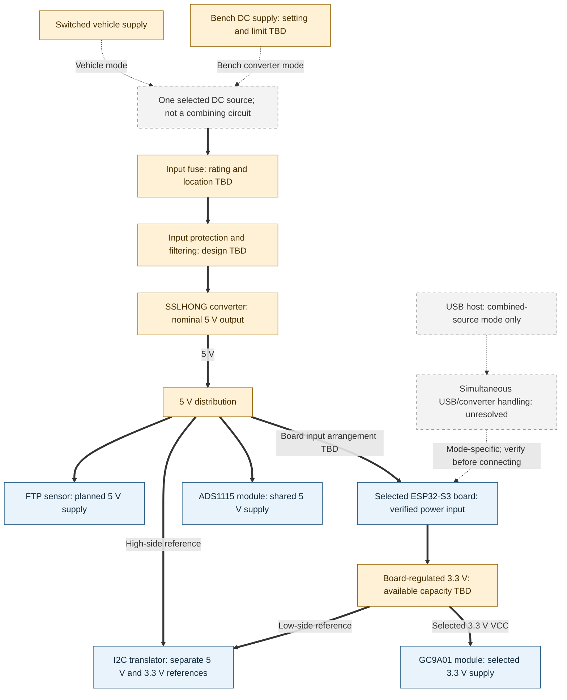
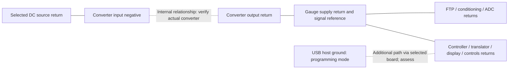

# Gauge power architecture

A02 describes the planned power paths for the single-channel gauge using either the N16R8 bench board or the XIAO ESP32-S3. The embedded Mermaid views expand [A01](gauge-system.md). Exact pins, protection parts, fuse rating and simultaneous-power handling remain unresolved.

For the XIAO implementation, [P02](../pinouts/xiao-esp32s3.md) documents the manufacturer pin functions, USB-linked VBUS and conflicting regulator-current references. The available peripheral budget and combined-power arrangement remain unresolved.

[P06: converter interface](../pinouts/buck-converter.md) records the vendor-labeled input leads, USB-C output and converter checks needed to resolve these power paths.

The [selected N16R8 USB power plan](../components/esp32-s3-dev-board/power-plan.md) uses native USB, IN-OUT closed and USB-OTG open, with L21 supplying the shared nominal 5 V branch. This adopts the official V1.4 board-family circuit as a working assumption for the pictured V1.3 board. The input diode remains; Q05/Q12 retain actual voltage/load checks. Display VCC is selected at 3.3 V within its listed 3-5 V range (Q31).

## Supply and distribution

This view expands the converter modes and unresolved combined-source mode. The separate USB-only W01 path is defined in its [harness](../wiring/bench/README.md) and [board power plan](../components/esp32-s3-dev-board/power-plan.md); it does not pass through the vehicle converter or the unresolved combined-source boundary below.



**Legend:** thick arrows are intended supply paths; dashed arrows are alternative sources, unresolved interfaces or candidate rails. All are planned, not tested. The source-selection node describes a build/operating choice, not a purchased switch, multiplexer or automatic supply-sharing circuit.

The converter's USB-C output is a power output, not the programming host. One selected controller is used per build. The sensor and ADC share regulated 5 V; the I2C translator separates its 5 V bus from ESP32 3.3 V logic. The board's 3V3 output supplies the translator low-side reference and compatible peripherals. No additional regulator is selected. Verify available current and actual distribution separately for N16R8 and XIAO. Display VCC uses board 3V3; module current/backlight behavior and rail margin remain checks.

## Returns and reference domains



**Legend:** solid lines indicate intended return/reference relationships; dotted lines indicate relationships requiring verification. This is a logical reference view, not a prescribed star-ground layout, chassis-bond map, isolated-supply claim or wire routing. Separate analog and digital groups make noise/return-current review visible; they do not specify disconnected grounds.

Use a compatible common reference for sensor, conditioning, ADC, translator and controller as described in the [power component notes](../components/gauge-power-supply/README.md). Verify the converter's input/output return relationship and each board's USB-ground relationship before specifying physical bonds. Select the actual vehicle ground point, return conductors, splice locations and signal routing in the harness design. A USB host can add a return path; assess it with the selected power mode rather than assuming it is isolated.

## Operating modes

| Mode | Intended source | Scope and unresolved condition |
| --- | --- | --- |
| Vehicle operation | Switched vehicle supply through fuse/protection/converter | Normal target; no USB host in this baseline. Exact source, ground point and installed behavior remain unverified. |
| Bench converter evaluation | One selected bench DC source through the converter path | Input voltage/current limit must suit the actual converter and test plan. Verify unloaded output before connecting loads. |
| W01 USB development | Computer USB through N16R8 native USB | Selected operating approach: power plus programming/debugging, with converter disconnected. IN-OUT closed exposes L21 nominal 5 V; L1 supplies display/translator 3V3. Physical voltage and source/load margin remain Q05/Q12. |
| W01 standalone USB operation | Suitable standalone USB supply through N16R8 native USB | Selected alternative: disconnect computer, change source and restart. Supply selection and full-load capability remain pending; no simultaneous sources. |
| Converter-powered debugging with USB | Converter plus USB host | Unresolved: requires documented board power-path behavior and a selected backfeed/isolation strategy. Not an approved connection configuration yet. |

No onboard battery, direct bench 5 V injection or automatic source switching is selected. Q03 selects alternate USB sources for W01, with restart accepted between modes; see the [bench power requirements](../wiring/README.md#bench-power-requirements). Full-gauge USB operation is intended, not electrically verified. The distribution diagram retains the converter path for vehicle and converter evaluation work; W01 defines the selected USB-fed distribution separately, with phased electrical checks. Check signal connections to unpowered modules when choosing a test configuration.

## Rail and load responsibilities

| Domain | Intended users | Evidence / remaining work |
| --- | --- | --- |
| Vehicle/bench input | Converter through fuse and selected input conditioning | The converter's advertised 8-60 V range is a vendor claim, not automotive transient qualification; verify actual operating conditions. |
| Nominal 5 V | Selected controller's appropriate power input, shared FTP/ADS1115 branch and translator high side | Sensor requirements, converter output performance, connectors and board power path need verification. |
| Board-regulated 3.3 V | Controller internally, translator low side and compatible peripherals | Verify regulator margin, actual ADC module, I2C pull-ups and logic voltage. |
| Display supply | One GC9A01 module | 3.3 V VCC and logic selected from the purchased listing range and ESP32 compatibility; current/backlight and margin remain Q06/Q12. |
| Conditioning and controls | Depends on the chosen circuit | Passive elements need a reference; any active circuitry needs an explicitly selected supply. No extra regulator is selected here. |

The converter's advertised 5 V / 3 A output does not establish available current from a controller board's regulator. The earlier 0.5-1 A input-fuse range remains a preliminary note, not a selection. Component ratings, wire gauge, protection location and startup/operating currents must be reconciled together.

The [ADC decision](../components/adc/conditioning-review.md) removes analog divider scaling by sharing regulated 5 V between sensor and ADC. I2C translation maintains ESP32-compatible logic. Keep the sensor and ADC on the same branch; evaluate local rail differences, power transitions and translator behavior when one domain is absent. Sharing a supply does not establish ratiometric measurement or calibration accuracy because the ADS1115 uses an internal reference.

## Design and validation work remaining

1. Identify actual board revisions, power pins/connectors, USB power paths, regulator limits, display requirements and converter return relationships.
2. Measure converter output and rail noise under representative loads, including startup and display activity; record instrument, conditions and configuration.
3. Establish a power budget with measured startup/operating current and margin for the selected board, sensor, ADC and display. Do not reserve expansion capacity based only on the converter label.
4. Select fuse, wiring and input protection/filtering. Reverse-polarity and transient behavior, cranking dropout and recovery remain unresolved.
5. Resolve powered/unpowered signal behavior, grounding and USB backfeed before producing assembly-ready wiring.
6. Document and validate the selected bench configuration before deriving the separate vehicle harness. Follow the [test plan](../../docs/testing/test-plan.md) and retain [measurement records](../../data/README.md).

This architecture records current intent and pending decisions; it does not report electrical tests or define vehicle stop limits. Other diagrams remain selectable through the [inventory](../DIAGRAMS.md).

## Diagram validation

Both views were rendered and visually reviewed with Mermaid CLI 12.0.0 and Node 24.15.0. Checked labels, branching, alternative-path styling and return relationships; no clipping was observed. This validates presentation only. Previews remain private scratch output; the Markdown blocks are the published source.

To reproduce, extract the first and second Mermaid blocks to `power-system-1.mmd` and `power-system-2.mmd` in a scratch directory, then run:

```powershell
npx.cmd --yes --package @mermaid-js/mermaid-cli@12.0.0 mmdc -i power-system-1.mmd -o power-system-1.png --size 2000 -b white
npx.cmd --yes --package @mermaid-js/mermaid-cli@12.0.0 mmdc -i power-system-2.mmd -o power-system-2.png --size 1600 -b white
```
