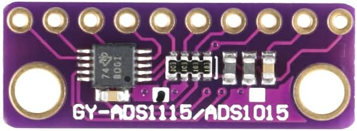
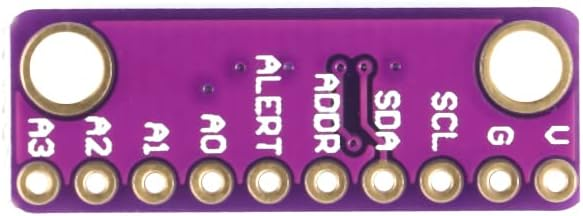

# ADS1115 acquisition modules

In the PCV/crankcase-pressure monitor we’ve been designing, the **ADS1115 is there primarily because we care about accurately measuring very small changes in the FTP sensor’s analog voltage**. It sits between the pressure sensor and the ESP32.

The basic chain is:

**Crankcase pressure → FTP sensor → analog voltage → ADS1115 → digital I²C data → ESP32 → display/logging**

### What the ADS1115 actually is

The ADS1115 is a **16-bit analog-to-digital converter (ADC)**. It has four analog inputs, an internal voltage reference, a programmable gain amplifier (PGA), and communicates with the ESP32 digitally using I²C. TI specifies up to 860 samples/sec and four single-ended analog channels. [Texas Instruments](https://www.ti.com/product/ADS1115?DCM=yes\&ds_k=ADS1115+Datasheet\&utm_source=chatgpt.com)

So when the FTP sensor says something like:

> "The pressure I'm seeing corresponds to 2.487 volts."

the ADS1115 measures that voltage very precisely and sends a number to the ESP32.

The ESP32 then applies our calibration equation:

$$
V_{\text{sensor}} \rightarrow P_{\text{crankcase}}
$$


and gives us something useful such as:

**−1.8 inH₂O**<br>
or<br>
**−4.5 mbar**<br>
or<br>
**−0.065 PSI**

depending on how we decide to display it.

---

## Why not just connect the FTP sensor to the ESP32?

The ESP32 has ADC inputs, so a design could use them with suitable input conditioning. The 5 V sensor output cannot simply be connected to a 3.3 V input.

The ESP32-S3 already contains ADC inputs.

But crankcase pressure is a particularly good application for the ADS1115 because we're looking for **small pressure differences around atmospheric pressure**, not something enormous like 0–100 PSI.

For example, imagine the FTP sensor operates over roughly a 0.5–4.5 V range. A very small crankcase-pressure change might only move its output by a few millivolts.

For a simplified comparison, a 12-bit converter spanning 0-3.3 V would have nominal code spacing of:

$$
\frac{3.3V}{4096} \approx 0.806\,mV/\text{count}
$$

This calculation is an illustration, not a characterization of the ESP32-S3's actual input range or accuracy, which also depends on attenuation, calibration, noise and nonlinearity.

The ADS1115 gives us **16-bit conversion plus a precision internal reference and PGA**. TI specifically designed it for precision sensor measurement. [Texas Instruments](https://www.ti.com/product/ADS1115?DCM=yes\&ds_k=ADS1115+Datasheet\&utm_source=chatgpt.com)

At the ±6.144 V range, for example, the ADS1115 scale is about:

$$
187.5\,\mu V/\text{count}
$$

or:

**0.1875 mV per count.**

That is finer code spacing than the simplified 12-bit comparison. **Resolution is not accuracy:** a smaller voltage step does not remove sensor error, noise or calibration error. The complete chain still needs the project's calibration procedure.

And at lower PGA ranges, the ADS1115 gets even more sensitive.

---

# The "amplifier" part is a little misleading

The Amazon description calling it an **"Amplifier Module"** can make it sound like we're using it to boost the FTP sensor's voltage.

We're not, really.

The ADS1115 has a **Programmable Gain Amplifier (PGA)** internally. It changes the measurement range of the converter.

TI gives these programmable full-scale ranges:

- ±6.144 V
- ±4.096 V
- ±2.048 V
- ±1.024 V
- ±0.512 V
- ±0.256 V [Texas Instruments](https://www.ti.com/lit/ds/symlink/ads1115.pdf?utm_source=chatgpt.com)


Suppose we were measuring a signal that only moved between 0 and 0.5 V.

Instead of wasting most of the ADC's available measurement range, we could configure it for ±0.512 V and get much greater effective resolution.

That's what the "gain" feature is doing.

It **does not produce a boosted analog output** for us.

---

# Why this matters especially for the PCV system

The goal isn't merely:

> "Do I have vacuum?"

We want to characterize what the PCV system is actually doing with the engine, the catch can, and the interchangeable restrictors.

We want to eventually be able to log things like:

| Engine condition | Crankcase pressure |
|---|---:|
| Engine off | ~0 relative pressure |
| Warm idle | Negative pressure in inH2O; value to measure |
| 1,700 RPM cruise | Signed pressure in inH2O; value to measure |
| Deceleration | Signed pressure in inH2O; value to measure |
| Wide-open throttle (WOT) | Signed pressure in inH2O; value to measure |
| 3 mm restrictor | X |
| 2 mm restrictor | X |
| 4 mm restrictor | X |

That's considerably different from simply installing an idiot light.

As a **hypothetical comparison, not project measurements or acceptance targets**, consider:

**2 mm restrictor:** -7 inH2O at idle<br>
**3 mm restrictor:** -3 inH2O at idle<br>
**4 mm restrictor:** -1 inH2O at idle<br>
**Wide-open throttle:** +5 inH2O

that's extremely useful information.

Compare measured pressure with manifold absolute pressure (MAP), engine speed (RPM) and operating condition to evaluate restrictor sizing. The hypothetical values above do not predict how the actual variants will behave.

The ADS1115 provides the voltage measurements for these comparisons; sensor calibration and repeatable test conditions determine whether the pressure results are meaningful.

---

# Think of each piece this way

In our system:

**FTP sensor = pressure → electricity**

It physically senses the crankcase pressure and generates an analog voltage.

**ADS1115 = electricity → accurate number**

It measures that voltage accurately.

**ESP32-S3 = number → intelligence**

It converts voltage into pressure, applies calibration, filters the reading, drives the display, logs data, possibly communicates over Wi-Fi/Bluetooth, etc.

So:

```text
        PCV / Catch Can
              │
              │ pressure tap
              ▼
        ┌─────────────┐
        │ FTP Sensor  │
        └──────┬──────┘
               │
         Analog voltage
               │
               ▼
        ┌─────────────┐
        │   ADS1115   │
        │  16-bit ADC │
        └──────┬──────┘
               │
              I²C
         SDA + SCL
               │
               ▼
        ┌─────────────┐
        │  ESP32-S3   │
        └──────┬──────┘
               │
        Calculate pressure
        filter / log / display
```

---

## There's one important electrical issue we need to handle

This is the piece we particularly want to remember when we wire the bench.

**The ADS1115's programmable ±6.144 V range does NOT mean we can put 6.144 V into it regardless of its power-supply voltage.**

The allowable analog input voltage is constrained by the ADC's supply rails.

The ADS1115 itself can operate from **2.0–5.5 V**. [Texas Instruments](https://www.ti.com/product/ADS1115?DCM=yes\&ds_k=ADS1115+Datasheet\&utm_source=chatgpt.com)

So if our FTP sensor is powered from 5 V and is capable of producing approximately **0.5–4.5 V**, we can't casually do this:

```text
5V FTP sensor
     │
0.5-4.5V output
     │
     ▼
ADS1115 powered at 3.3V   ← problem
```

because the sensor can produce a voltage above the ADS1115's 3.3 V supply.

We need to deliberately choose the architecture.

### One good architecture

The selected bench and gauge architecture is:

```text
              regulated 5V
                 │
        ┌────────┴─────────┐
        │                  │
        ▼                  ▼
   FTP Sensor          ADS1115
        │                  │
        └── 0.5-4.5V ─────► A0
                           │
                           │ I²C
                           ▼
                     level shifting
                           │
                         3.3V
                           │
                           ▼
                       ESP32-S3
```

That lets the ADS1115 comfortably measure the entire sensor output.

The **SDA/SCL lines must not feed 5 V into the ESP32's 3.3 V GPIO**. Use a bidirectional I²C translator, with pull-ups in each voltage domain. At a 5 V supply the ADS1115 requires a logic high of at least 3.5 V, so moving its pull-ups to 3.3 V alone is not a guaranteed interface. The [hiBCTR BSS138 module](../i2c-level-shifter/README.md) is selected under Q28; physical pull-up and bus checks remain Q29.

There are other valid ways to build it, including running the ADS1115 at 3.3 V and scaling the FTP output with a resistor divider.

---

## And we get three extra analog channels for free

That's another reason I like it for the project.

The ADS1115 gives us:

**A0, A1, A2, A3**

We're presently using one for crankcase pressure.

That leaves three precision analog channels available for future experimentation.

For example:

```text
ADS1115
│
├─ A0 → Crankcase FTP pressure
├─ A1 → Future sensor
├─ A2 → Future sensor
└─ A3 → Future sensor
```

So we could eventually measure another pressure transducer, battery/system voltage through an appropriate divider, a second PCV pressure point, or some other analog diagnostic channel.

---

### The shortest explanation

If someone asked why the thing is in the PCV controller, I'd say:

> **The FTP sensor produces an analog voltage representing crankcase pressure. The ADS1115 is a high-resolution 16-bit ADC that accurately measures that voltage and sends the result digitally to the ESP32. We use it instead of relying on the ESP32's comparatively crude onboard ADC because we're trying to measure very small crankcase pressure changes accurately.**

# ADS1115 Module Selection

Selected external ADC: **ADS1115 modules**, [Amazon B0BXDLZLZS](https://www.amazon.com/dp/B0BXDLZLZS). Supplied notes confirm **three modules purchased for USD 5.98 total**. Planned allocation is one bench module, one finished-gauge module, and one spare/expansion module. The modules have not yet arrived; chip identity and operation remain unverified.

The intended measurement path is FTP sensor, input filtering/protection, ADS1115 on 5 V, then translated I2C to ESP32-S3. The controller handles calibrated pressure, peak tracking, and display rendering. An external ADC keeps the acquisition design consistent between the N16R8 bench board and XIAO controller; changing the actual ADC or analog circuit still calls for calibration review.

See [A01: overall gauge architecture](../../architecture/gauge-system.md) for the ADC between analog conditioning and the controller, with signal and power boundaries distinguished.

See [A03: pressure measurement signal chain](../../architecture/measurement-system.md) for how conversion counts become calibrated pressure, validity state, peaks and display values.

See [P03: ADS1115 module interface](../../pinouts/ads1115.md) for header orientation, terminal functions, address options and electrical verification before wiring.

## Device specification reference

The exact reference revision is stored as the [local ADS111x datasheet](../../datasheets/ads1115-datasheet.pdf). See the [datasheet index](../../datasheets/README.md) for document identity, provenance, and checksum; retain the official TI links below for checking updates.

TI specifies the ADS1115 as a 16-bit delta-sigma ADC with a multiplexer for four single-ended or two differential measurements, programmable gain, internal reference/oscillator, and four selectable I2C addresses. Supply range is 2.0-5.5 V; the IC temperature range is -40 to +125°C. These IC specifications do not qualify the purchased breakout assembly. Reference: [TI ADS111x datasheet, SBAS444E, December 2024](https://www.ti.com/lit/ds/symlink/ads1115.pdf), consulted 2026-10-06.

Nominal output rates are **8, 16, 32, 64, 128, 250, 475, and 860 SPS**. The PGA range does not permit analog inputs beyond the supply rails in normal operation. Inputs are multiplexed, so the maximum conversion rate is not available independently on every channel at once. See sections 5.3, 7.3, and 8 of the [TI datasheet](https://www.ti.com/lit/ds/symlink/ads1115.pdf).

## Supplied board references





The front silkscreen says `GY-ADS1115/ADS1015`, which does not establish which device is populated. Verify the received IC and behavior before relying on ADS1115 specifications. The rear image labels `V`, `G`, `SCL`, `SDA`, `ADDR`, `ALERT`, and `A0` through `A3`. These vendor views do not establish the actual board schematic, pull-up supply, address configuration, or ESP32 GPIO assignments.

See the [N16R8](../esp32-s3-dev-board/README.md), [XIAO](../xiao-esp32s3/README.md) and [GC9A01](../gc9a01-display/README.md) introductions for how computation and display complement ADC acquisition. The [integration guide](../gauge-electronics/README.md#reading-and-building-path) provides a reading and assembly path.

## Preliminary electrical plan

- **Selected:** power the ADS1115 and FTP sensor from the same regulated nominal 5 V branch. This supersedes the earlier controller-3V3 ADC supply.
- Keep the ESP32 I2C side at 3.3 V and add a bidirectional I2C level translator to the ADC's 5 V side. The hiBCTR BSS138 module is selected under Q28; fitted pull-up and bus checks remain Q29; no direct 5 V bus connection to the ESP32 is intended.
- Use A0 single-ended for pressure and **+/-6.144 V full-scale range** for the assumed 0-5 V signal. Analog voltage must still remain between ground and ADC VDD; the range setting does not permit a 6.144 V input on a 5 V-powered part.
- Remove analog divider scaling from the baseline. Use the initial [470 ohm / 1 uF RC input filter](../rc-input-filter/README.md). Stock parts, response and power/protection behavior remain Q17. TI's 100 nF supply decoupling recommendation is separate from the A0 signal capacitor.
- ADDR-to-GND / 0x48, single-shot 128 SPS and readiness polling remain W01 bring-up candidates. ALERT stays unused.

The [conditioning review](conditioning-review.md) owns this decision, its rationale and remaining implementation work. It applies to the N16R8 bench and XIAO target; each still needs its own power distribution and GPIO configuration. [P03](../../pinouts/ads1115.md) describes the two voltage domains. The purchased module has not arrived; normal assembly checks confirm its connections against the listing.

## Sampling, peaks, and calibration

The notes propose approximately 100-200 samples/sec for acquisition and 20-30 display updates/sec. These are goals, not measured performance or final configuration. Choose a supported conversion rate (128 SPS lies within the proposed acquisition range), then measure effective throughput and peak response. Polling faster does not create new conversions. Channel expansion and display work must not silently reduce the pressure sample rate.

Keep peak capture separate from display smoothing, and evaluate the entire sensor, analog filter, ADC, and software response before claiming short spikes are captured. Resolution alone does not establish pressure accuracy or noise performance.

Calibrate the complete installed sensor/filter/ADC chain against a known pressure reference. Preserve raw counts, gain/rate/channel settings, module identity, analog component values, and calibration revision. Zero, slope, noise, linearity, and repeatability require measurement; a new module is not automatically interchangeable without rechecking calibration.

Future options include additional conditioned sensors, multiple displays, or additional addressed ADC modules. The notes prefer obtaining MAP digitally from Holley rather than using an analog channel; no Holley interface is implemented or verified. These options do not expand the initial one-pressure-channel scope.

## Import record - 2026-10-06

Imported project notes and two third-party product images from batch `ADC`. Public images are in `media/reference/adc/`; purchase details and selections are reflected in the [BOM](../../bom/parts.md), [gauge plan](../../components/gauge-electronics/README.md), and [firmware plan](../../../firmware/README.md).

Reviewed visible images for personal identifiers; none were observed. Removed embedded JPEG application/comment metadata without recompression, verifying unchanged orientation, dimensions, and decoded pixels. Preserved product labels; inbox originals remain unchanged. Product URL uses the canonical ASIN path.

Reviewed TI's supply, logic thresholds, gain scaling and input constraints for the shared 5 V design. No physical wiring, calibration, electrical testing or firmware build was performed. The [test plan](../../../docs/testing/test-plan.md) remains the basis for physical validation.
