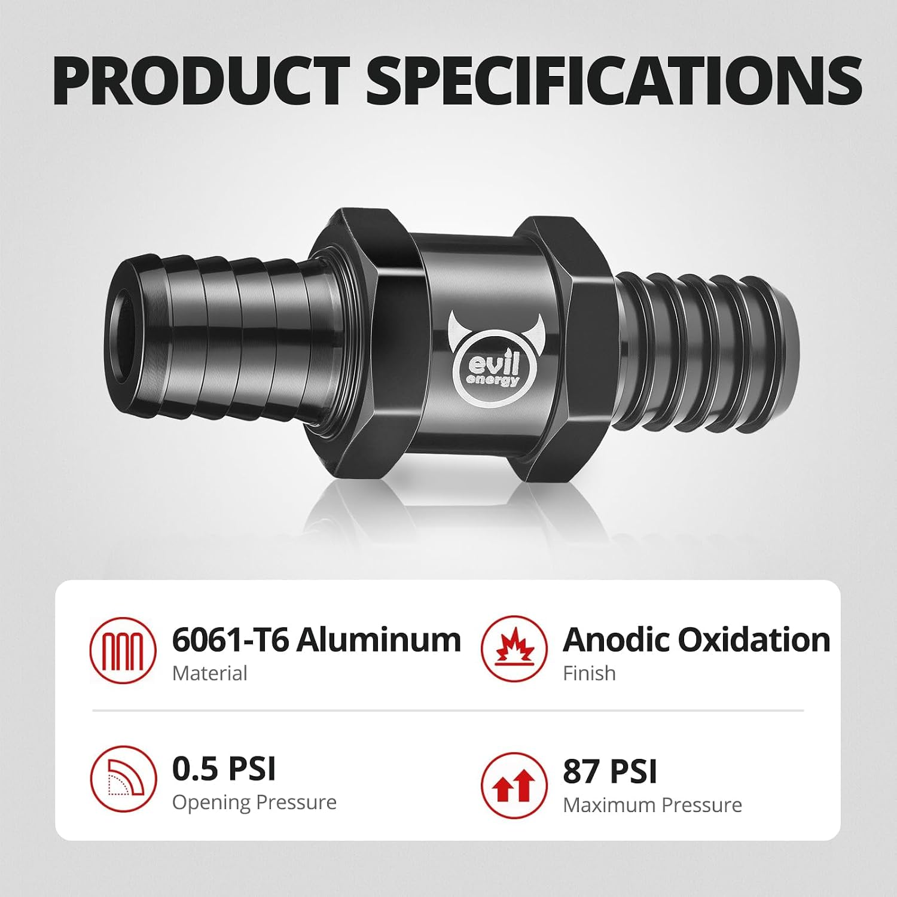
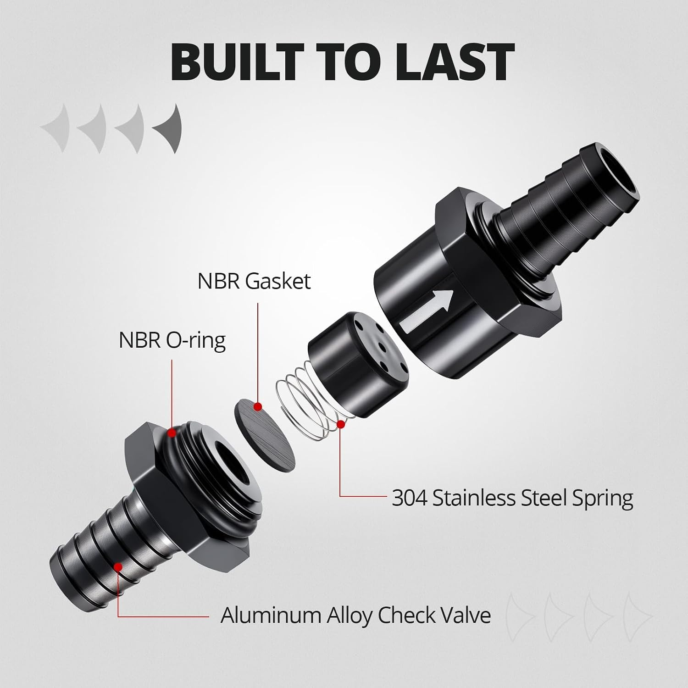
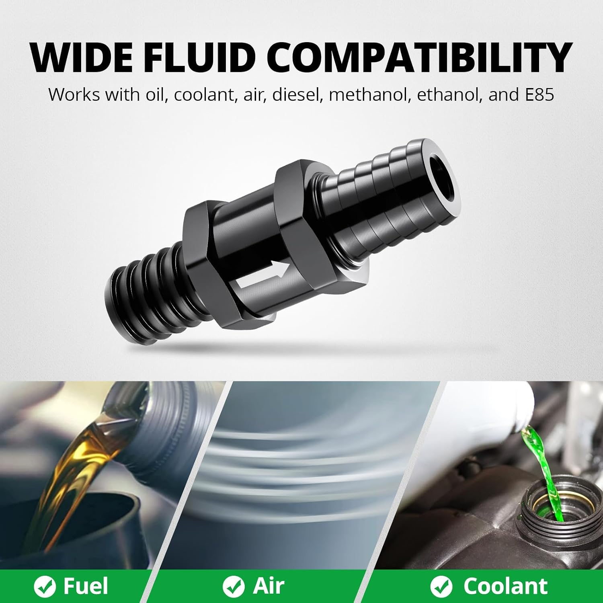

# Check valve / proposed pressure relief

## One-way flow and pressure relief

A **check valve** permits flow in one direction and resists flow in the reverse direction. In a spring-loaded design, forward pressure must overcome the closing force before the valve begins to open. That differential pressure is called **cracking pressure**. It is different from the pressure rating of the valve body and from the pressure needed to pass a useful flow rate.

This project proposes using the purchased check valve on a catch-can branch directed outward to atmosphere. During crankcase vacuum, that branch should remain closed rather than admitting unmetered air. During positive pressure, a suitably low opening threshold could provide an additional outward path. The restricted intake-vacuum branch remains a separate path; the relief valve does not meter normal manifold-vacuum evacuation.

### Why a check valve is still only a relief candidate

A one-way fuel valve is not automatically a characterized crankcase pressure-relief device. Its opening threshold, flow capacity, reverse leakage and behavior in vapor all matter here. A valve might begin opening at an acceptable pressure yet still require substantially more pressure to pass the required flow.

The supplied vendor image advertises 0.5 PSI cracking pressure, approximately **13.8 inH2O**. The project's provisional relief target is approximately **2.77 inH2O** (0.1 PSI). That difference explains the interest in characterization and possible spring changes; it does not establish a suitable modification. Reducing spring force can also change closure and leakage, so opening, reseating and reverse-flow checks belong together in the [bench-test plan](../../../docs/testing/test-plan.md).

The lesson for this component is to separate **direction**, **opening pressure** and **flow capacity**. None can be inferred solely from the hose size or maximum-pressure claim. The supplied internal illustration below is evidence of advertised construction, not a measured spring specification.

## Selected hardware

Purchased item: **EVIL ENERGY 1/2 in (12 mm) aluminum one-way fuel check valve**, black, three-piece pack with hose clamps, Amazon ASIN **B0FQJ71WZW**. Three valves were purchased for **USD 18.04 total**. See the [BOM](../../bom/parts.md).

This check valve is a candidate for the separate catch-can-to-atmosphere relief path. Receipt, disassembly, modification, installation, and bench performance have not been confirmed.

See [A04: PCV system overview](../../architecture/pcv-system.md) for the outward-only relief branch from the catch can to atmosphere and its relationship to the restricted intake return.

## Vendor reference images

These product-listing illustrations accompany the [Amazon listing](https://www.amazon.com/dp/B0FQJ71WZW). They are vendor claims, not inspection photographs of the purchased units or independent verification. Source branding and visible labels are preserved; images are third-party reference material, not project-created artwork.

### Published specifications

The supplied illustration states 6061-T6 aluminum, an anodized finish, **0.5 PSI opening pressure**, and **87 PSI maximum pressure**. The maximum-pressure claim is not an opening setting or evidence of adequate relief flow.

### Internal construction

The exploded illustration labels an aluminum body, NBR O-ring, NBR gasket, and 304 stainless steel spring. Actual component dimensions and materials have not been inspected or verified.

### Compatibility claims

The vendor illustration lists oil, coolant, air, diesel, methanol, ethanol, and E85. These claims do not establish durability or sealing performance in this project's crankcase-vapor environment.

## Validation still required

The listed 0.5 PSI opening pressure is approximately 13.8 inH2O, above the project's provisional relief-opening target of approximately 0.1 PSI (2.77 inH2O). The images support the origin of the published claim; they do not establish the purchased valves' actual cracking pressure.

Follow the [relief bench-test plan](../../../docs/testing/test-plan.md): confirm flow direction, measure opening/reseating pressure and reverse leakage, record any spring changes, and assess flow capacity separately. No spring change or acceptance of this valve as a validated relief device is implied by this import.

## Import record - 2026-10-06

Imported all three images from supplied batch `check-valve-relief-valve`. Inbox originals remain unchanged. Public copies use descriptive filenames under `media/reference/` to distinguish vendor illustrations from project photographs and CAD views.

| Supplied filename | Public filename |
| --- | --- |
| `713ecekBA6L._AC_SL1500_.jpg` | `product-specifications.jpg` |
| `61a4Vq6yuwL._AC_SL1500_.jpg` | `exploded-view.jpg` |
| `71h2DoDb4aL._AC_SL1500_.jpg` | `fluid-compatibility.jpg` |

Reviewed visible content for personal identifiers; none were observed. Removed JPEG application/comment metadata, preserving orientation and decoded pixels without recompression. Verified image decoding, dimensions, pixel equality, and absence of embedded metadata in the public copies. No visual redactions, generative edits, or physical tests were performed.
