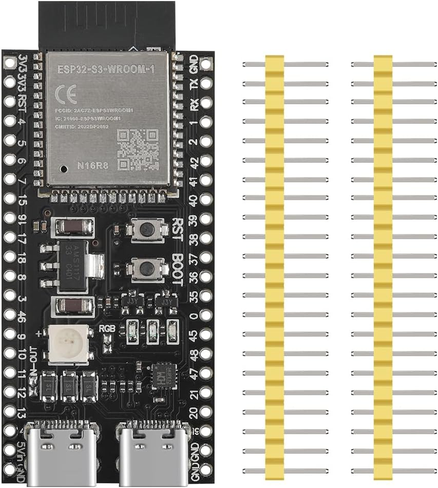

# ESP32-S3 N16R8 bench development board

## What the board does

This board runs the bench gauge program: it reads the ADS1115, applies pressure calibration, tracks peaks, handles the button and updates the display. It is the selected controller for [W01](../../wiring/bench/README.md), where accessible headers support probing, protoboard construction and USB debugging. The [XIAO ESP32-S3](../xiao-esp32s3/README.md) is the compact finished-gauge target.

**ESP32-S3** names the microcontroller family. A **module** combines the chip with supporting parts; the **carrier/development board** provides headers, power and programming interfaces. Two carriers can use the same processor while exposing different pins and power paths. The board therefore needs its own [P01 interface map](../../pinouts/esp32-s3-devkit.md), rather than treating a chip pinout as a wiring diagram.

### Flash, RAM and N16R8

The purchased listing describes **16 MB flash and 8 MB PSRAM**, reflected in its N16R8 designation. Flash retains firmware and other stored content without power. RAM holds working state; PSRAM is additional working memory available to software. Extra memory can support buffers, but does not by itself increase sensor accuracy or guarantee acquisition timing. Pins associated with the memory configuration must remain available to that hardware; use P01's restrictions when assigning gauge signals.

As a practical distinction, a program image belongs in flash, while a temporary display buffer belongs in RAM. Calibration/settings persistence needs an explicit software storage design; it is not achieved by leaving a value in working RAM.

## Selected hardware and evidence

Purchased listing: [Amazon B0D93DLB6Q](https://www.amazon.com/dp/B0D93DLB6Q), reported **USD 7.99**. Quantity was not explicitly specified. The board has not yet arrived; supplied images are online references, not photographs of received hardware. The [BOM](../../bom/parts.md) owns procurement status.

The [bench-board evidence record](bench-board-reference.md) collects the YD-style candidate, pictured labels, USB roles and jumper questions. The [original electronics import record](../gauge-electronics/README.md#import-record---2026-10-06) retains provenance for the image above. Media paths remain unchanged.

## Power, signals and debugging

W01 selects computer USB for power/debugging or standalone USB for operation without a computer, one source at a time. Disconnect and restart when switching. The [selected power/debug plan](power-plan.md) uses native USB, IN-OUT closed and USB-OTG open. Left row 21 / 5Vin supplies the nominal 5 V branch, while left row 1 / 3V3 supplies the display and translator LV. This is a documented board-family assumption; rail and load checks remain Q05/Q12.

The sensor and ADC share a regulated 5 V branch. ESP32 signals remain 3.3 V, so the ADC's I2C data and clock connect through a bidirectional translator. The display uses a separate SPI interface. Exact GPIOs and electrical endpoints belong in P01 and W01; the [gauge integration guide](../gauge-electronics/README.md) explains the complete chain.

Firmware should select a board-specific pin/power configuration while sharing acquisition, calibration and UI logic with the XIAO build. No firmware implementation or successful bench operation is implied by this selection.

## Learning and bring-up

Follow [W01's phased assembly](../../wiring/bench/README.md#phased-assembly-and-verification). Controller-only startup checks programming and the chosen power path. Adding peripherals then tests combined load and interfaces. A successful unloaded boot does not prove that the board can supply the complete gauge.

Record the actual board, rail readings and configuration when hardware arrives. Q04/Q05/Q12/Q14 in the [question register](../../../docs/open-questions.md) track the remaining board, power and allocation work.
