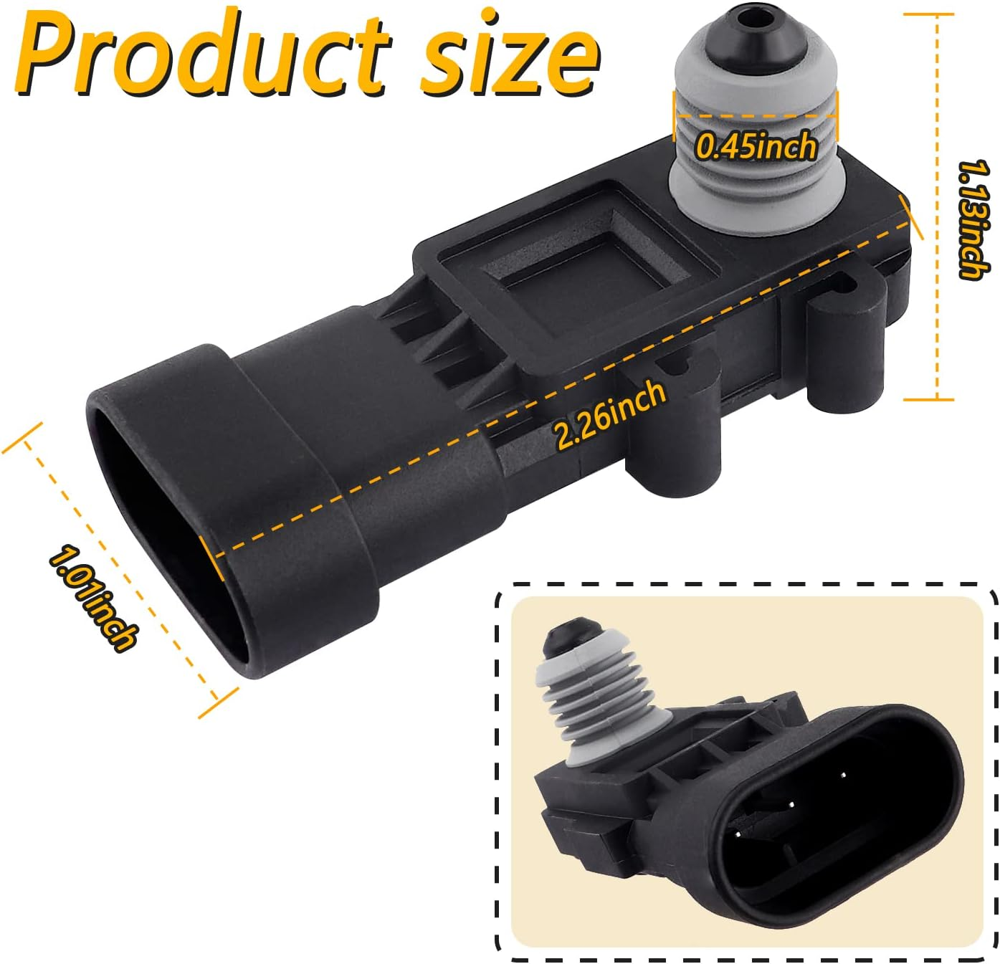

# Fuel-tank pressure sensor and pigtail

The planned gauge uses a GM 16238399-style low-range FTP sensor and a three-terminal pigtail. Supplied purchase details confirm the following items; compatibility and electrical behavior still require verification.

See [A04: PCV system overview](../../architecture/pcv-system.md) for the proposed upstream pressure tap and sensor mounting questions, and [A01: overall gauge architecture](../../architecture/gauge-system.md) for the conditioned electrical measurement path.

See [P04: FTP sensor and pigtail interface](../../pinouts/ftp-sensor.md) for connector-view conventions, the unresolved terminal map and verification steps before wiring.

## Purchase details

| Item | Purchased listing | Reported price |
| --- | --- | ---: |
| Aftermarket FTP sensor, listing cross-references 16196060 / 16238399 / 12219388 | [Amazon B0CNZ2Q1F2](https://www.amazon.com/dp/B0CNZ2Q1F2) | USD 7.89 |
| HiSport 13585316 fuel tank pressure sensor connector | [Amazon B09NVW46W2](https://www.amazon.com/dp/B09NVW46W2) | USD 7.99 |

Quantities and receipt/installation status were not specified. Prices are recorded as supplied, without assuming per-unit or pack pricing. The sensor listing's OEM-number references describe claimed compatibility, not proof of an OEM-manufactured sensor. PT2782 and PT2646 remain historical connector cross-references rather than separately purchased items.

## Supplied product references

Two product-listing images were supplied in batch `fuel-tank-pressure-sensor`, followed by the saved purchase details above. Images document appearance and advertised dimensions, not inspected hardware or a verified pinout.

### Sensor dimensions

The image labels overall length as 2.26 in, height as 1.13 in, connector-end width as 1.01 in, and a dimension across the pressure-port area as 0.45 in. The last callout does not establish an internal bore, thread specification, or required hose size. Confirm actual dimensions before designing an adapter or mount.

### Pigtail details

The image shows front and back views of a three-terminal connector, three light-colored wires, and three splice connectors. Advertised lead length is 15 cm (5.9 in). The visible original-equipment wording is a vendor claim; it does not verify manufacturer, authenticity, physical fit, or terminal assignments.

## Electrical and calibration status

No terminal-to-signal mapping is established by these images. Verify connector orientation and terminal positions for supply, ground, and output using documentation for the actual part before applying power; do not assign functions by wire color or by visual resemblance alone.

The existing design concept assumes a 5 V, three-wire analog sensor. Actual supply requirements, output range, ADC compatibility, pressure range, zero, and transfer function remain to be verified. No generic calibration equation or pressure limits are inferred from the product photographs.

See the [firmware requirements](../../../firmware/README.md), [calibration/test plan](../../../docs/testing/test-plan.md), and [BOM](../../bom/parts.md).

## Import record - 2026-10-06

Imported `ftp-sensor.jpg` as `sensor-dimensions.jpg` and `pigtail.jpg` as `pigtail-details.jpg` under `media/reference/fuel-tank-pressure-sensor/`. These are third-party product illustrations, not project-created artwork or photographs of received hardware. Inbox originals remain unchanged.

Reviewed visible content for personal identifiers; none were observed. Removed JPEG application/comment metadata without recompression. Verified unchanged orientation, dimensions, and decoded pixels, and absence of personal metadata in public copies. No visual redactions, generative changes, physical fit checks, electrical tests, or calibration were performed. Purchase details were subsequently incorporated from the saved text file; the original remains in private staging.
