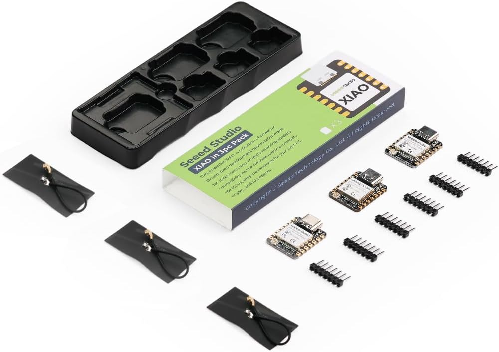

# Gauge electronics

The gauge uses **ESP32-S3**, with an N16R8 development board for bench work, a **Seeed Studio XIAO ESP32-S3** as the intended finished-gauge controller, and a **Hosyond 1.28-inch GC9A01 round TFT** for the first display prototype. These selections supersede the earlier Nano/OLED candidates.

See [A01: overall gauge architecture](../../architecture/gauge-system.md) for how these components connect conceptually, including the alternative bench and finished-gauge controllers.

See [P01: bench-board interface](../../pinouts/esp32-s3-devkit.md) for the pictured N16R8 header labels, GPIO restrictions and verification checklist.

See [P02: XIAO interface](../../pinouts/xiao-esp32s3.md) for edge-pin aliases, bus candidates and power-reference limits for the finished-gauge board.

## Purchased hardware

Prices and selections below are reported. Specifications are from the supplied listing descriptions, not measurements or independently verified datasheets. Receipt, board revision, assembly, and operation have not been confirmed.

| Role | Item / source | Quantity | Reported price | Listed configuration |
| --- | --- | --- | --- | --- |
| Bench development | [ESP32-S3 N16R8 board, B0D93DLB6Q](https://www.amazon.com/dp/B0D93DLB6Q) | Not explicitly specified | USD 7.99 | 16 MB flash, 8 MB PSRAM, exposed GPIO, Wi-Fi/Bluetooth |
| Finished-gauge controller | [Seeed Studio XIAO ESP32-S3, B0DJ6NQFKX](https://www.amazon.com/dp/B0DJ6NQFKX) | 3 boards, one pack | USD 21.59 total | 8 MB flash, 8 MB PSRAM, dual-core ESP32-S3, USB, Wi-Fi/BLE, battery support |
| Initial display | [Hosyond GC9A01 TFT, B0DYP4J9XP](https://www.amazon.com/dp/B0DYP4J9XP) | 3 displays, one pack | USD 14.39 total | 1.28-inch round display, 240 x 240 pixels, 4-wire SPI |

The N16R8 board is intended for breadboarding, sensor/ADC/display testing, controls, probing, and USB debugging. The three XIAO boards are intended for the installed gauge, a bench controller matching the gauge hardware, and a spare/future gauge. These are planned roles, not completed deployments.

## Display and interface

See [P05: GC9A01 display interface](../../pinouts/gc9a01.md) for header orientation, SPI signal roles, power/backlight questions and verification before wiring.

Start with one GC9A01 screen displaying signed live pressure in `inH2O` and minimum/maximum values. Evaluate readability from the driver's seat before finalizing the display and enclosure.

The notes describe a square PCB and approximately 32.4 mm active circular area. The supplied image instead shows a rounded PCB with a connector tab and mounting holes. Use the actual module's measured outline, mounting holes, connector clearance, and viewing area for enclosure design; the approximate active-area figure is not an enclosure dimension.

The supplied vendor pin-reference image lists the following symbols. This is a transcription of its interface descriptions, **not a verified wiring diagram or assignment of ESP32 GPIOs**. In this SPI reference, `SCL` and `SDA` label serial clock and data; they do not indicate an I2C display.

| Display label | Vendor-described function |
| --- | --- |
| VCC | Power; voltage not specified in the supplied image |
| GND | Power ground |
| SCL | Serial interface clock |
| SDA | SPI data; image describes latching on the rising clock edge |
| DC | Data/command selection |
| CS | Chip select, active low |
| RST | Reset, active low |

Verify the actual board labels, supply and logic levels, reset behavior, and module documentation before wiring. The image's generic FPC wording and the pictured header do not establish a separate connector specification. GPIO assignments and driver-library choices remain open.

## Planned measurement and power arrangement

The proposed first prototype uses the [SSLHONG vehicle-to-5 V converter](../../components/gauge-power-supply/README.md), purchased for USD 13.99, the FTP sensor, ESP32-S3 controller, an **[ADS1115 external ADC](../../components/adc/README.md)**, one SPI display, and button(s). Three ADC modules were purchased for USD 5.98 total. I2C and a 3.3 V ADC supply are planned; module identity, gain/rate, address, logic levels, and final conditioning circuit remain to be verified or selected.

Resolve the actual sensor output range, ADC input/reference limits, I2C logic levels, board power inputs, display supply, and grounding together. The 5 V system supply does not imply that every signal or peripheral can connect directly to 5 V. This import does not establish a wiring schematic.

## Firmware direction

Planned environment: **VS Code, PlatformIO, Arduino framework for ESP32, C/C++**. No environment definitions, platform versions, board IDs, dependencies, or firmware have been created yet.

Use shared application code for the development board and XIAO, with board-specific GPIO and hardware configuration isolated. Keep acquisition, calibration, filtering, and peak capture independent of the display implementation. A display should render pressure state without owning measurement or calibration logic. See the [firmware requirements](../../../firmware/README.md).

Initial bring-up order: development board, one display, verified ADC/sensor interfaces, calibrated pressure, deliberate zero, and min/max capture; then evaluate in-vehicle readability. Saved peaks should allow later review without watching the display during a pull.

## Display options retained for later

- One 1.28-inch pressure gauge: initial prototype and possible final configuration.
- Several small displays in a pod: potential future channels include fuel/oil pressure, oil/coolant temperature, or differential pressure. Shared SPI clock/data with separate chip selects is a proposed approach, pending pin-budget and bus/driver validation.
- A larger approximately 2.1-inch round display if readability requires it. No specific larger module is selected or purchased; active-screen size does not establish compatibility with a conventional gauge opening.

These are future options, not requirements to implement multiple channels now. Keep display size and controller choice out of pressure-measurement logic.

## Import record - 2026-10-06

Source batch: `guage-electronics` (original spelling retained in private staging). Imported the technical notes into this document, the BOM, firmware README, current status, and agent guidance. Public names use `gauge-electronics`.

| Supplied image | Public image |
| --- | --- |
| `dev-board.jpg` | `esp32-s3-development-board.jpg` |
| `guage-production-board.jpg` | `xiao-esp32s3-pack.jpg` |
| `GC9A01-display.jpg` | `gc9a01-display.jpg` |
| `GC9A01-pin-definition.jpg` | `gc9a01-pin-definition.jpg` |

All four are third-party product-reference images, not photographs of received or tested hardware. Reviewed visible content for personal identifiers; none were observed. Preserved product labels and branding. Removed embedded JPEG application/comment metadata without recompression and verified unchanged orientation, dimensions, and decoded pixels. Public product links omit query parameters and seller-selection identifiers. Inbox originals remain unchanged.

No hardware tests, voltage checks, GPIO assignments, firmware builds, or live supplier specification verification were performed during this documentation import. See the [BOM](../../bom/parts.md) and [project status](../../../docs/status.md) for remaining work.
