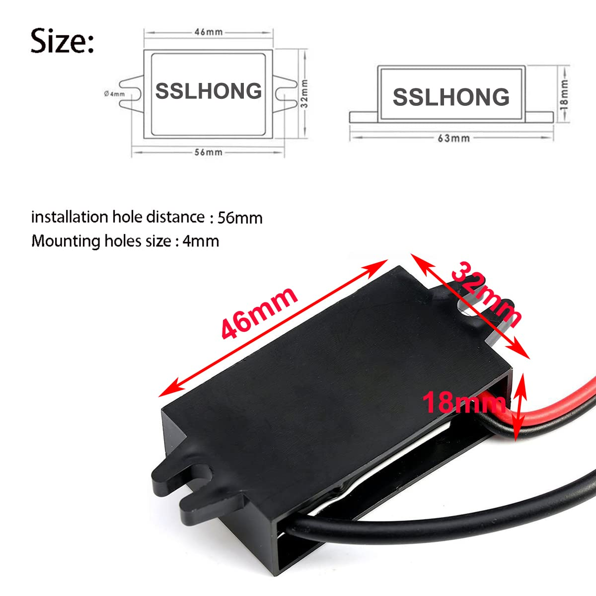

# Gauge power supply

Selected converter: **SSLHONG DC 8-60 V input, USB-C 5 V / 3 A buck converter**, [Amazon B09NVG35CX](https://www.amazon.com/dp/B09NVG35CX). Supplied notes confirm purchase for **USD 13.99**. Quantity, purchase date, receipt, installation, and operation were not explicitly confirmed. See the [BOM](../../bom/parts.md).

See [A01: overall gauge architecture](../../architecture/gauge-system.md) for the converter within the planned gauge power path. See [A02: power architecture](../../architecture/power-system.md) for planned supply modes, distribution, returns and unresolved USB-power handling.

The [XIAO power reference in P02](../../pinouts/xiao-esp32s3.md) records conflicting published 3V3 current figures and the USB-linked 5V rail. Resolve the board revision and usable load margin before finalizing distribution.

See [P06: converter interface](../../pinouts/buck-converter.md) for input/output identification, connector evidence limits and verification before harness design.

## Published specifications

These values come from the supplied listing notes and product images, not independent testing or a newly verified supplier datasheet.

| Property | Advertised value |
| --- | --- |
| Input | 8-60 VDC |
| Output | Regulated 5 VDC, USB-C |
| Maximum output current | 3 A |
| Nominal maximum output power | 15 W, calculated as 5 V x 3 A |
| Environmental rating | IP67, per supplied notes |
| Construction | Enclosed / potted-style module |
| Listed protections | Over-temperature, short-circuit, over-current, overload |

The pictured label identifies red as input positive and black as input negative. Confirm the actual unit's labeling before connection. The image shows a USB-C output plug; no USB data functionality or USB Power Delivery capability is established by this reference.

## Selection rationale and planned role

The notes select this converter as the vehicle-to-gauge regulator primarily for its 8-60 V input range, enclosed construction, 5 V output, and potential expansion capacity. The earlier alternative considered had an approximately 8-35 V range. The 60 V ceiling is a listed input rating, not proof of automotive load-dump qualification; no such qualification has been established.

The planned power path is switched vehicle supply, an upstream fuse, any selected transient/input protection, then the converter and a 5 V gauge bus. Intended loads include the ESP32-S3 board, FTP sensor, and display/ADC through their appropriate supply arrangements. This is a concept, not a completed wiring schematic.

The supplied notes propose a **0.5-1 A input fuse** as a starting range. Final rating, wire gauge, location, and fuse characteristics remain pending actual load/startup-current measurements and wiring design. The converter's 3 A output rating is not an input-fuse prescription or evidence that downstream board regulators can supply the same current.

Additional TVS protection, bulk/bypass capacitance, and reverse-polarity protection remain under consideration. Component selection, transient performance, operation during cranking, and recovery behavior have not been validated.

## Distribution and measurement considerations

Use the selected ESP32-S3 board's `3V3` output for the ADS1115 and other compatible 3.3 V peripherals. Use the appropriate board power input and verify available regulator current and actual header location for each board variant. The FTP sensor is planned around a 5 V supply, but its actual electrical requirements, the external ADC reference/input limits, and display voltage compatibility remain to be verified together. Sharing a supply does not by itself establish ratiometric measurement accuracy.

USB-C may simplify prototype power; a breakout or short pigtail is an option for the final harness. Connector retention, strain relief, and the interaction between vehicle power and USB programming power remain design tasks. The IP67 claim does not establish that the complete harness, USB connection, or gauge enclosure is sealed.

A common sensor/ADC/controller ground, appropriate analog routing and filtering, and calibration of the complete sensor/ADC assembly are part of the intended design. Output regulation, ripple, load margin, thermal behavior, and usable expansion capacity are unmeasured. The supplied notes expect the first gauge to draw substantially less than 3 A; a measured power budget is still needed.

## Mechanical reference

| Dimension | Vendor-image value |
| --- | ---: |
| Main body | 46 x 32 mm |
| Height | 18 mm |
| Overall mounting span | 63 mm |
| Mounting-hole spacing | 56 mm |
| Mounting-hole/slot size | 4 mm |

The illustration shows slotted mounting ears. Confirm actual dimensions, cable exits, bend clearance, and fastener fit before designing the mount. These are reference dimensions, not measurements of the purchased unit.

## Remaining integration work

Confirm received hardware and polarity; verify unloaded and loaded output; measure operating/startup current and noise; select the fuse and protection; establish supply distribution and USB-power handling; and check mounting, retention, and thermal behavior. Record results separately from these vendor claims. See the [gauge electronics plan](../../components/gauge-electronics/README.md) and [test plan](../../../docs/testing/test-plan.md).

## Import record - 2026-10-06

Imported the supplied `gauge-power-supply` notes into this reference and the project BOM/status. The two product images retain their descriptive filenames under `media/reference/gauge-power-supply/`. They are third-party listing references, not project-created artwork or photos of received hardware.

Reviewed visible content for personal identifiers; none were observed. Stripped JPEG application/comment metadata without recompression and verified unchanged orientation, dimensions, and decoded pixels. Preserved visible product labeling. Inbox originals remain unchanged. No physical testing, electrical verification, live supplier lookup, or certification review was performed during import.
