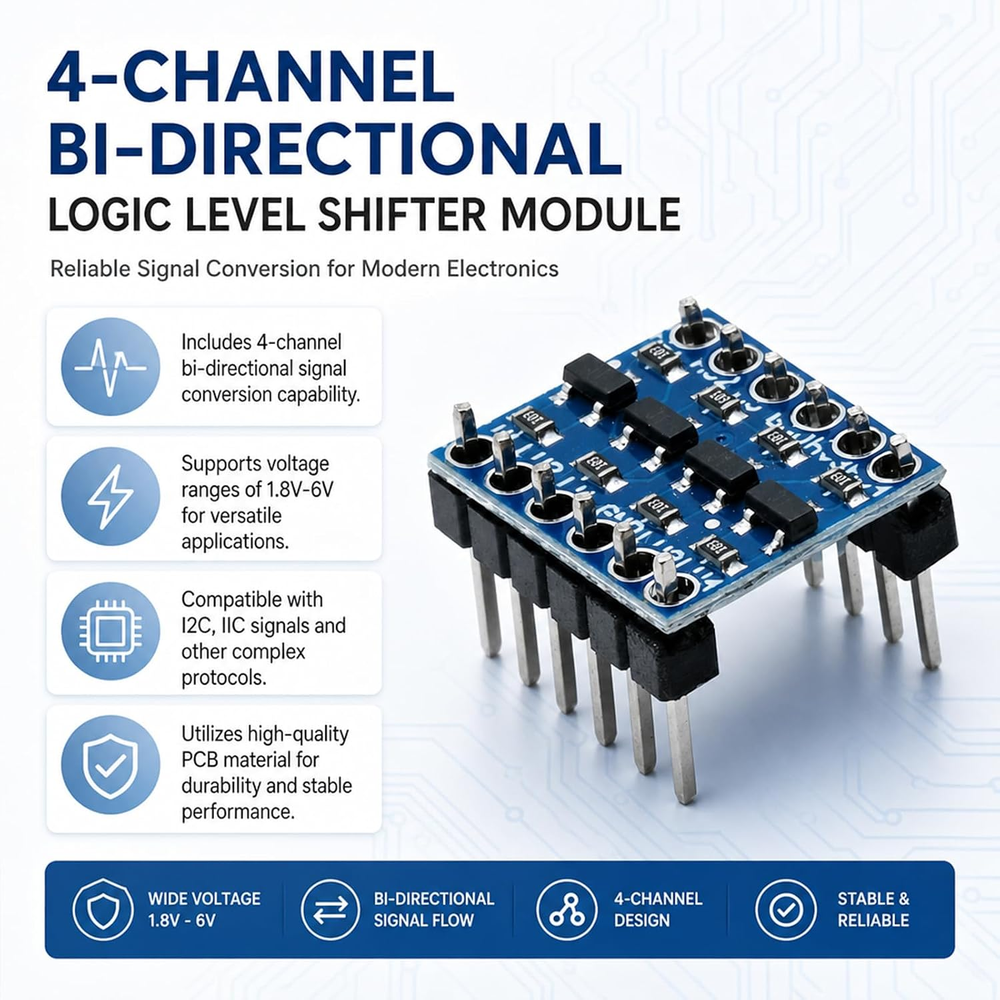
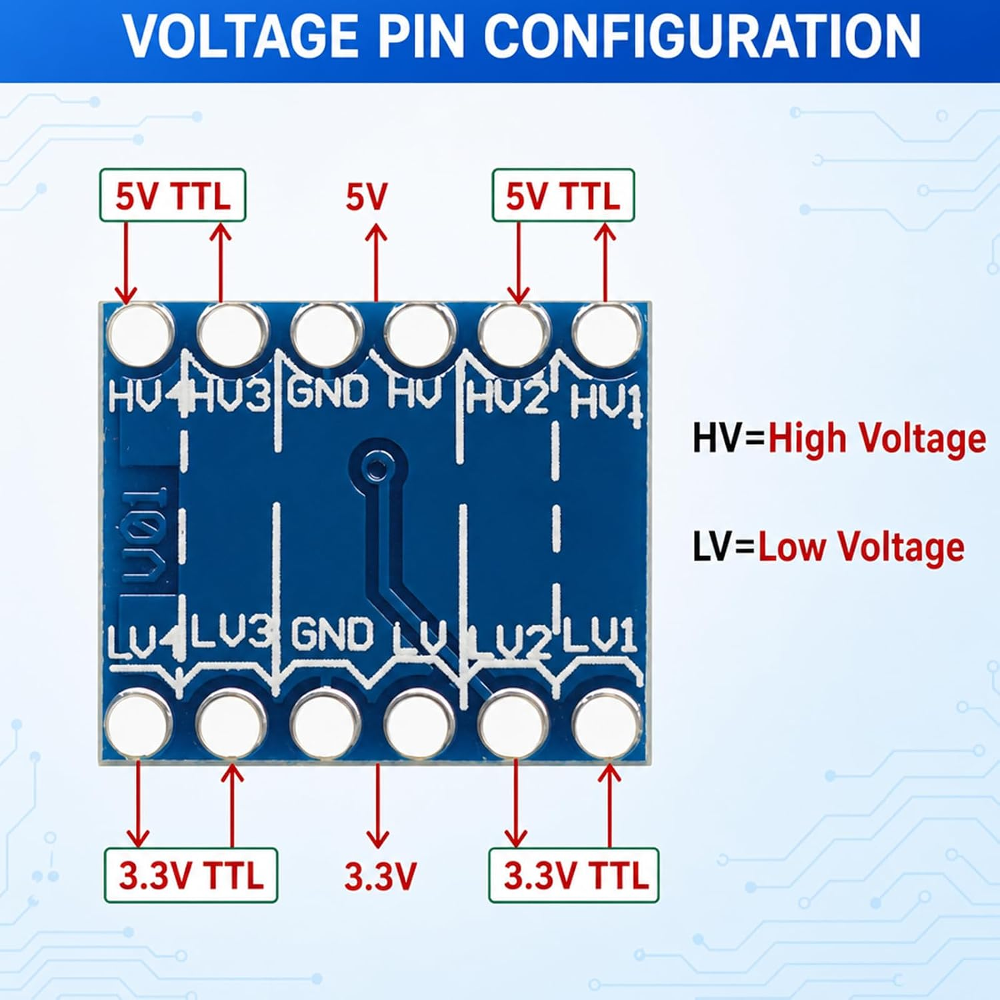
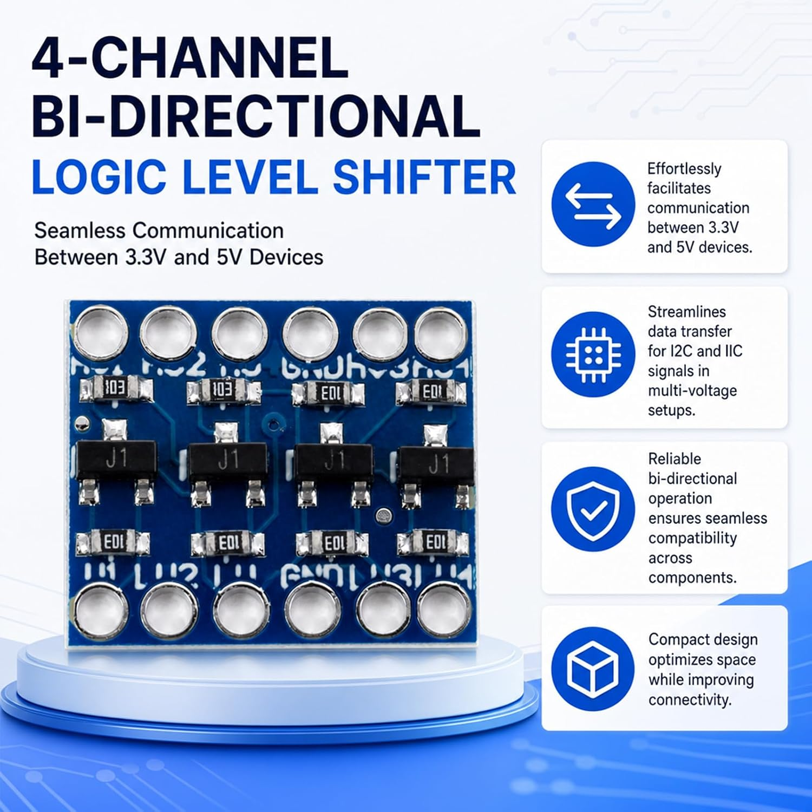
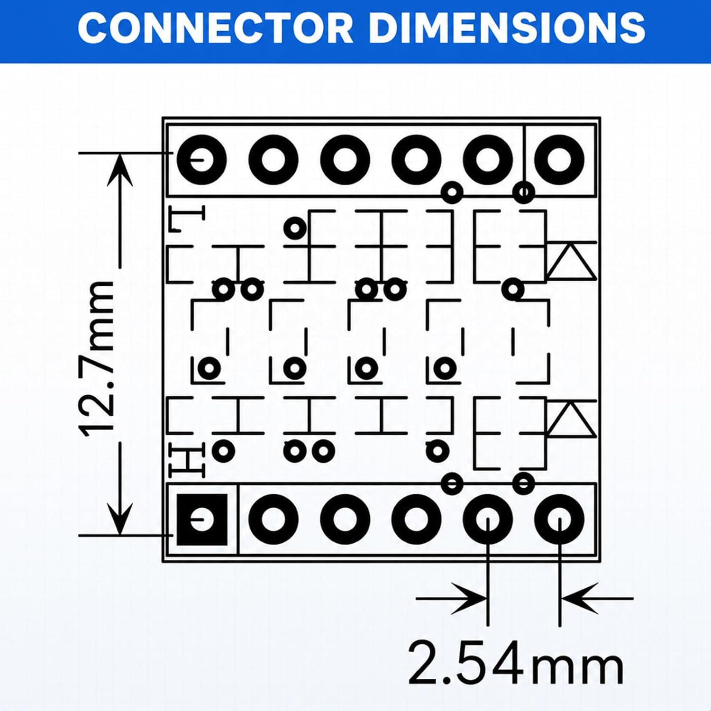

# Bidirectional I2C level shifter

## Why this component is needed

The ADS1115 and FTP sensor share regulated 5 V so the ADC can measure the unscaled sensor signal. The ESP32-S3 uses 3.3 V logic. This module connects their I2C buses while keeping the idle/high voltage on each side at its own supply level. It is in the **digital data/clock path**, not the analog sensor-to-A0 path.

At a 5 V supply, the ADS1115 specifies a minimum logic-high input of 3.5 V. Pulling the whole bus to 3.3 V would not guarantee that threshold; pulling it to 5 V would expose the ESP32 to the wrong voltage. [P03](../../pinouts/ads1115.md) and the [electrical review](../adc/conditioning-review.md) explain this boundary.

### How a MOSFET translator works

I2C uses **open-drain** signaling: devices pull a line low or release it, and pull-up resistors return it high. A BSS138 MOSFET channel allows a low to propagate in either direction, while separate pull-ups establish the high voltage in each domain. This allows both the controller and ADC to communicate without a direction-control pin. [Philips application note AN97055](https://cdn-shop.adafruit.com/datasheets/an97055.pdf) explains the general circuit; it is not a schematic or qualification of this purchased board.

The module does not generate 3.3 V or 5 V and is not a galvanic isolator. Supply references and common ground must be connected. No enable GPIO or additional regulator is selected for this BSS138 module.

## Purchased module

**hiBCTR four-channel bidirectional logic level converter**, listed as BSS138 MOSFET-based, [Amazon B0DSZBC8K6](https://www.amazon.com/dp/B0DSZBC8K6). One **10-module pack was purchased for USD 6.88 total**. Receipt and operation have not been reported. Use one module per controller build; allocation of the remaining stock is unspecified. See the [BOM](../../bom/parts.md).

The supplied images advertise a 1.8-6 V range and I2C compatibility. The visible resistors are marked `103`, consistent with nominal 10 kohm pull-ups in the advertised topology; these are image-based design assumptions, not resistance measurements. Initial operation remains the project's **100 kHz candidate**. The notes' 400 kHz suitability is not adopted as a demonstrated speed; bus rise time also depends on pull-ups and wiring capacitance.

## Terminal view and selected connections

Use the **solder/back-side view**, as shown below, with the HV row above the LV row. Labels read left to right:

- HV row: **HV4, HV3, GND, HV, HV2, HV1**.
- LV row: **LV4, LV3, GND, LV, LV2, LV1**.

The component-side view mirrors this layout. Wire by the visible label and stated face; do not copy left/right positions between faces. `GND_HV` and `GND_LV` below distinguish the two physical pads both marked GND; they are documentation aliases, not additional voltage domains or manufacturer pin numbers.

The vendor graphic's top **5 V arrow appears aligned with the GND pad rather than HV**. Use the printed **HV** terminal for 5 V and **LV** for 3.3 V; the advertising arrows do not override the silkscreen labels.

| Module label | W01 use |
| --- | --- |
| LV | Board-derived 3.3 V |
| HV | Shared ADC/sensor 5 V branch |
| GND, both rows | Common carrier ground; pad aliases GND_HV/GND_LV |
| LV1 / HV1 | ESP32 SDA / ADS1115 SDA |
| LV2 / HV2 | ESP32 SCL / ADS1115 SCL |
| LV3 / HV3, LV4 / HV4 | Unused; leave external connections open |

[W01's source and schedule](../../wiring/bench/README.md) own the exact N16R8 connections and wire identities. A XIAO build uses the same module-side assignment with its separately selected GPIOs. Neither channel is tied to a fixed direction.

## Pull-ups and bring-up

Start with the module's assumed fitted pull-ups, accounting for resistors already on the ADC and controller sides; no extra external pull-up set is selected. Parallel resistors lower the effective resistance. For a **hypothetical example**, 10 kohm in parallel with 10 kohm gives 5 kohm. Lower resistance increases low-state sink current and can shorten rise time; bus capacitance and device limits still matter. Actual values remain Q08/Q29.

Connect power off, using the selected USB mode to power both rail domains together. Do not treat the translator as permission to keep the 5 V side operating with the controller's 3.3 V rail absent. Inspect label/orientation and ground continuity during assembly, then verify LV/HV references and idle bus voltages before controller connection. Check communication at 100 kHz and startup/shutdown behavior with the actual assembly. These are Q29 bring-up checks, not completed tests or a separate identity investigation.

## Mechanical and product references

The dimension drawing advertises **2.54 mm pitch** and **12.7 mm between header-row centers**. The latter is not a board outline dimension. Nominal header spacing suits the planned protoboard construction; check socket clearance, actual header fit and support during layout. The listing images show assembled headers but do not confirm the delivered assembly state.

## Import record - 2026-10-07

Batch: `i2c-level-shifter`. Imported engineering content from the supplied README and four third-party listing images. Public links retain only the product ASIN; no tracking parameters or private staging links are required. Inbox originals remain unchanged.

| Supplied filename | Public filename |
| --- | --- |
| image.jpg | module-overview.jpg |
| image2.jpg | component-side.jpg |
| back.jpg | terminal-reference.jpg |
| dimensions.jpg | header-dimensions.jpg |

Reviewed visible content for personal/sensitive details; none required redaction. Removed JPEG application/comment metadata without recompression. Verified unchanged dimensions, orientation and decoded RGB pixels, and no retained EXIF, ICC, XMP or comments. Preserved vendor text and component markings. The resistor/terminal assumptions come from these references, not physical measurements. No hardware operation or electrical testing was performed.
