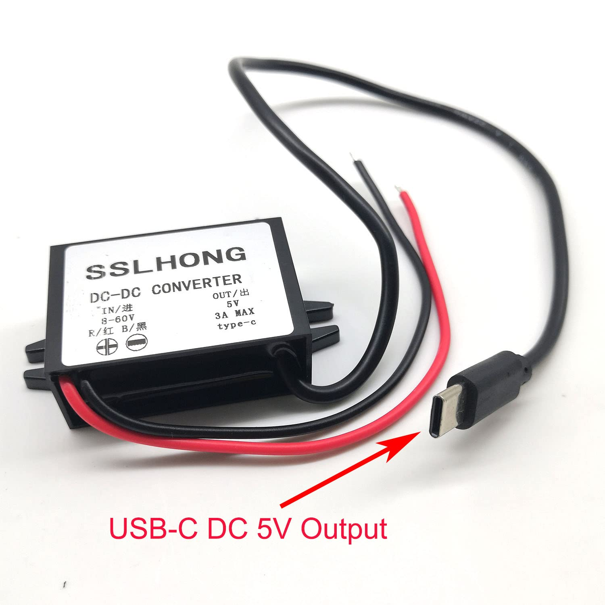

# P06: SSLHONG converter interface

**Document state: Draft.** This page records the pictured input leads and USB-C power output of the selected SSLHONG converter, plus the checks needed for bench and vehicle integration. Actual polarity, output performance and power-path behavior remain unverified. The [power component record](../components/gauge-power-supply/README.md) owns procurement, advertised specifications and mounting dimensions.

## Identity and connection reference

The purchased listing is SSLHONG B09NVG35CX. The supplied product label states DC-DC conversion, 8-60 V input and 5 V / 3 A maximum Type-C output. An exact model/revision beyond the listing identity is not established.

Use the **label-facing product view** above to identify the two separate input leads and the captive output cable. The label associates `R` / red with input positive and `B` / black with input negative. This is a vendor-labeled association, not a generic wire-color rule. Match the actual unit's label before connection. Cable position in the image does not define a terminal number.

The output is pictured as a USB-C plug. Its individual contacts, internal wiring and configuration circuitry are not established by this image. No cavity numbering or USB contact map is assigned here. If a breakout or adapter is selected, document its exact part, connector view and verified terminal mapping in the harness; do not infer its pad order from this photo.

## Interface map

Directions are relative to the converter. All pictured functions and ratings below have **Vendor Listing** evidence from the product image and [component record](../components/gauge-power-supply/README.md#published-specifications). None is bench verified.

| Connection / identification | Function | Direction | Domain / evidence limit |
| --- | --- | --- | --- |
| Separate red lead; label `R`, positive symbol | DC input positive | Power input | Advertised 8-60 VDC relative to input negative; actual unit labeling and lead specification require verification |
| Separate black lead; label `B`, negative symbol | DC input negative | Input return | Return to the selected DC source; internal relationship to output return unknown |
| Captive USB-C plug, labeled output | Regulated power delivery to the load | Power output and return | Advertised 5 VDC, 3 A maximum; actual contact wiring, tolerance and load capability unverified |
| USB-C shell and any other contacts | Functions not established by available references | Unknown | Do not treat shell as a designed return or assume data, configuration or shielding connections |

The 3 A figure is an advertised **output** limit. It does not specify input current, fuse size, usable controller `3V3` capacity or proven continuous output under installation conditions. The 8-60 V input range does not establish automotive transient qualification or behavior below 8 V during cranking.

## Power integration

Follow [A02: power architecture](../architecture/power-system.md) for source selection, returns and operating modes. The planned path is switched vehicle supply or one selected bench DC source, through the chosen fuse/input protection, into the converter. Its nominal 5 V output then supplies the designed gauge distribution. Exact source, fuse, conductors, connectors and protection remain TBD; the component record's preliminary fuse range is not a selected harness specification.

The selected ESP32-S3 board regulates the planned ADC/peripheral `3V3` rail. Check the appropriate board input and power paths in [P01: bench board](esp32-s3-devkit.md) or [P02: XIAO](xiao-esp32s3.md). The sensor remains planned for 5 V subject to [P04](ftp-sensor.md); the display supply remains unresolved in [P05](gc9a01.md). A USB-C plug does not by itself define how the separate sensor and display branches receive power.

A02's input/output return relationship remains unresolved. Verify it on the actual converter and document intended source, gauge and USB-host return paths. Do not claim galvanic isolation from an open continuity reading or assume a particular chassis bond from enclosure appearance.

The converter output is a power source, not the USB programming host. USB data, Power Delivery, current advertisement and attachment behavior have not been established by the supplied reference. Validate compatibility with the exact intended board or breakout, including both plug orientations where applicable. Do not connect the converter output to a host USB port or combine it with host-supplied power through an improvised adapter.

For USB-only controller bring-up, A02 keeps the converter disconnected. Converter-powered debugging with a USB host remains unresolved until the selected board and adapter power paths are documented and a backfeed strategy is selected. Reverse-current blocking and unpowered-converter behavior are not established by the converter label.

## Mechanical and harness boundary

Use the [dimension reference](../components/gauge-power-supply/README.md#mechanical-reference) when planning placement, then verify the actual mounting ears, fasteners, cable clearance and retention. Lead lengths, conductor gauge, insulation ratings, input termination and output strain relief are TBD. The advertised IP67 rating does not establish sealing of the exposed input splices, USB connection or completed gauge.

W01 and W05 will own bench and vehicle connectivity respectively; see the [inventory](../DIAGRAMS.md). Record any output breakout/pigtail and distribution connectors there, with orientation, polarity and current suitability. This page does not prescribe cable cutting or select an adapter.

## Verification before harness design

1. Identify the received converter and compare its label, input leads and output plug with the reference. Record any model/revision and differences before using the advertised ratings.
2. With power disconnected, verify the chosen test adapter's contact mapping and inspect connections for shorts. Characterize input/output return and shell relationships without treating a continuity check as an isolation qualification.
3. Define a current-limited bench source and input protection appropriate to the actual unit. Verify input polarity before energizing. Check output polarity and voltage through the intended connector/test fixture before attaching gauge electronics; record attachment conditions if output depends on a connected load.
4. Evaluate the intended load progressively. Record input voltage/current, startup behavior, output at the load, ripple, cable drop and temperature under representative conditions. Compare results with the requirements of the connected devices rather than assuming the label supplies a complete tolerance specification.
5. Check shutdown, supply interruption and recovery, including powered/unpowered signal paths. Evaluate cranking conditions within a defined test plan; do not use the vehicle or attached controller as an exploratory transient/protection test fixture.
6. Finalize the power budget, fuse, conductors, protection, return routing and USB programming arrangement from the results. Link the resulting harness and [measurement records](../../data/README.md); follow the [test plan](../../docs/testing/test-plan.md) before vehicle integration.

## Source reference

The [product image](../../media/reference/gauge-power-supply/power-supply.jpg) supplies the visible polarity and output-label evidence. The [dimension image](../../media/reference/gauge-power-supply/power-supply-dimensions.jpg) supplies mounting references. Their provenance and advertised protection claims are preserved in the [component record](../components/gauge-power-supply/README.md). No internal schematic, USB implementation specification or measured converter performance is currently recorded.
