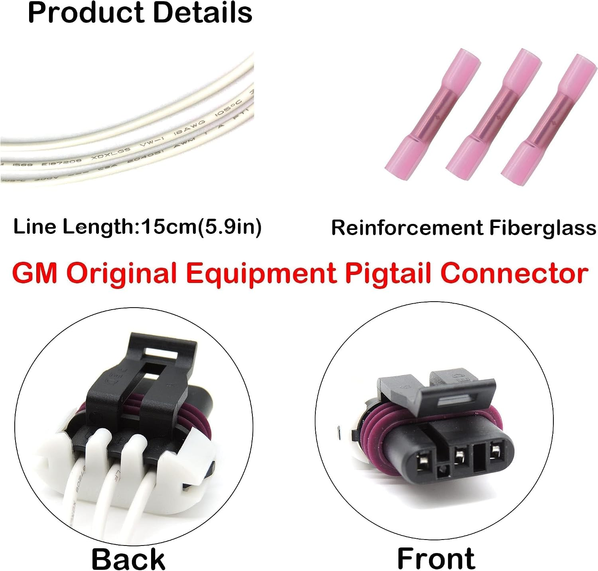

# P04: FTP sensor and pigtail interface

**Document state: Draft.** This page documents the available connector evidence and planned electrical and pressure interfaces for the purchased FTP sensor and HiSport pigtail. Terminal assignments, physical fit and sensor operating limits remain unverified. It is not an assembly-ready pinout.

## Parts and evidence

| Item | Recorded identity | Evidence and limits |
| --- | --- | --- |
| Sensor | Aftermarket listing B0CNZ2Q1F2; cross-references 16196060 / 16238399 / 12219388 | **Vendor Listing**. Actual manufacturer, marking and revision remain unknown; cross-references do not establish an OEM part or transfer curve |
| Pigtail | HiSport listing B09NVW46W2, advertised as 13585316 | **Vendor Listing**. Three-terminal connector and leads pictured; exact housing/terminal identifiers and fit remain unverified |

The [component record](../components/fuel-tank-pressure-sensor/README.md) owns purchase details, source links, dimensions and image provenance. PT2782 and PT2646 are historical cross-references, not verified identities for this connector. There is no part-specific manufacturer terminal drawing or measured terminal map in the repository.

## Connector views and position record

Use the lower-right **Front** inset as the pigtail **mating-face view**: look into the three terminal openings with the latch above the row. The lower-left **Back** inset shows the wire-entry side. These are angled vendor views, not orthographic connector drawings. Left and right reverse when switching between mating-face and wire-entry views while keeping the latch above the row.

The positions below refer only to the pictured pigtail mating face. They are spatial descriptions, not assigned cavity numbers or letters. Molded markings cannot be confidently established from this reference.

| Position, mating face with latch above | Molded cavity ID | Electrical function / domain / direction | Evidence |
| --- | --- | --- | --- |
| Left terminal opening | TBD | TBD | **Vendor Listing**: position visible; assignment **Unknown** |
| Center terminal opening | TBD | TBD | **Vendor Listing**: position visible; assignment **Unknown** |
| Right terminal opening | TBD | TBD | **Vendor Listing**: position visible; assignment **Unknown** |

All three pictured leads are light colored. Neither color nor routing in the illustration identifies a function. The advertised lead length is 15 cm (5.9 in); actual length, conductor specification, termination and strain relief must be checked for the harness.

The [sensor illustration](../../media/reference/fuel-tank-pressure-sensor/sensor-dimensions.jpg) includes an angled view into its electrical connector, but does not establish terminal labels. Do not copy the pigtail's left-to-right order directly onto a sensor-face drawing. Record both actual mating faces with their latch/key references, then establish how the cavities mate. Mechanical fit alone does not establish the electrical mapping.

## Planned electrical interface

The design assumes a three-wire analog sensor. The following are **functional requirements**, not terminal assignments; directions are relative to the sensor.

| Required function | Sensor cavity / pigtail lead | Direction | Planned domain and destination | Evidence |
| --- | --- | --- | --- | --- |
| Supply | TBD | Power input | Nominal 5 V from the gauge supply arrangement; required sensor voltage, tolerance and current TBD | **Planned**, actual requirements **Unknown** |
| Return / low reference | TBD | Power return and signal reference | Gauge measurement reference shared with conditioning and ADC; exact return routing TBD | **Planned** |
| Pressure output | TBD | Analog output | Input conditioning, then proposed ADS1115 A0; voltage span, atmospheric output and slope TBD | **Planned**, sensor behavior **Unknown** |

[A02: power architecture](../architecture/power-system.md) retains a planned 5 V sensor supply while the controller's `3V3` powers the ADC. Selecting `3V3` for peripherals does not change the sensor supply assumption. Verify the actual sensor's requirements before applying power; do not try terminal permutations to discover the pinout.

The sensor output must pass through the scaling/protection/filtering boundary in [A01](../architecture/gauge-system.md). [P03: ADC interface](ads1115.md) defines the ADC-side limits for the selected 3.3 V domain. The example divider in the [ADC notes](../components/adc/README.md#preliminary-electrical-plan) remains preliminary; it does not establish compatibility with the sensor's normal or fault output. Resolve supply tolerances, loading, return routing and the condition where the sensor is powered while the ADC is off.

Exact connector identifiers, lead labels, splices and destinations belong in W01 or W02 when developed through the [inventory](../DIAGRAMS.md). Do not assign ESP32 GPIOs to this analog sensor output; the planned controller interface is through the ADS1115.

## Pressure interface and calibration

[A04: PCV overview](../architecture/pcv-system.md) proposes a pressure tap at the catch-can outlet before the restrictor. The hose, adapter, sealing, retention and sensor mounting remain to be selected. The vendor's 0.45 in pressure-port-area callout does not establish a bore, thread or compatible hose size.

The gauge requires pressure relative to atmosphere, reported in `inH2O` with negative values for vacuum. Confirm how the actual sensor references atmosphere and preserve any required vent path when mounting it; no vent location is identified by the available images. Verify pressure limits and suitability for the intended environment, protect the sensor from liquid oil/water, and evaluate tubing response. Tap pressure may differ from crankcase pressure because of losses in the connecting flow path.

Atmospheric output voltage and the sign/slope of the electrical response are TBD. Do not assume zero volts at atmospheric pressure or import a generic GM calibration equation. Use [A03: measurement chain](../architecture/measurement-system.md) and the [test plan](../../docs/testing/test-plan.md) to calibrate the complete sensor/conditioning/ADC chain. Equalize to atmosphere deliberately; do not automatically zero while the engine runs.

## Evidence needed to complete the terminal map

1. Record actual sensor and connector markings. Photograph the sensor mating face, pigtail mating face and wire-entry side clearly, showing latch/key orientation and any molded cavity IDs.
2. Obtain a terminal-function reference applicable to that sensor identity. Record its source and viewing direction, and reconcile it with the actual housing. Similar appearance or listing cross-references alone are insufficient.
3. With the pigtail disconnected and unpowered, trace each cavity to its free lead by continuity and apply unique lead labels. This verifies the pigtail wiring only; it does not identify sensor terminal functions.
4. Confirm mechanical fit, keying, latch engagement, seals and terminal retention. Fill the position table with verified cavity IDs, corresponding leads and sourced functions before designing the harness.
5. After the terminal map and electrical limits are established, document a suitable current-limited bench setup. Measure supply and output at atmosphere, then known positive/negative pressures within the verified range. Record voltage at both sensor output and ADC input, along with configuration and raw conversions.
6. Link the terminal evidence, fit checks and calibration results using the [data conventions](../../data/README.md). Update this page, the component record and the harness when measurements establish or change a fact.

Documenting this interface does not establish that the purchased pair fits or works. The next evidence needed is the actual part identification and connector terminal reference; electrical and pressure validation follow that mapping.
