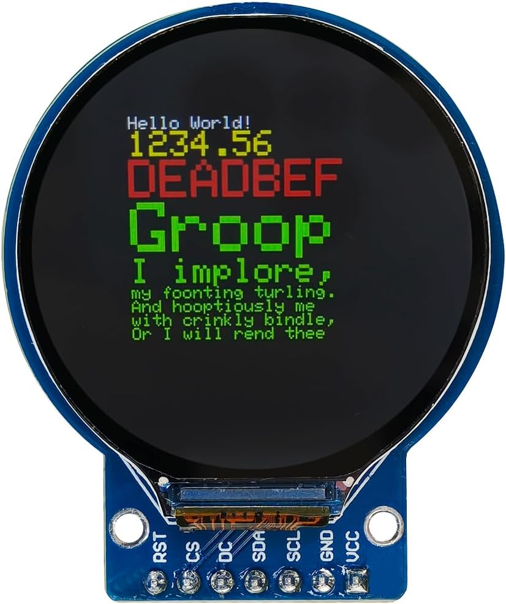
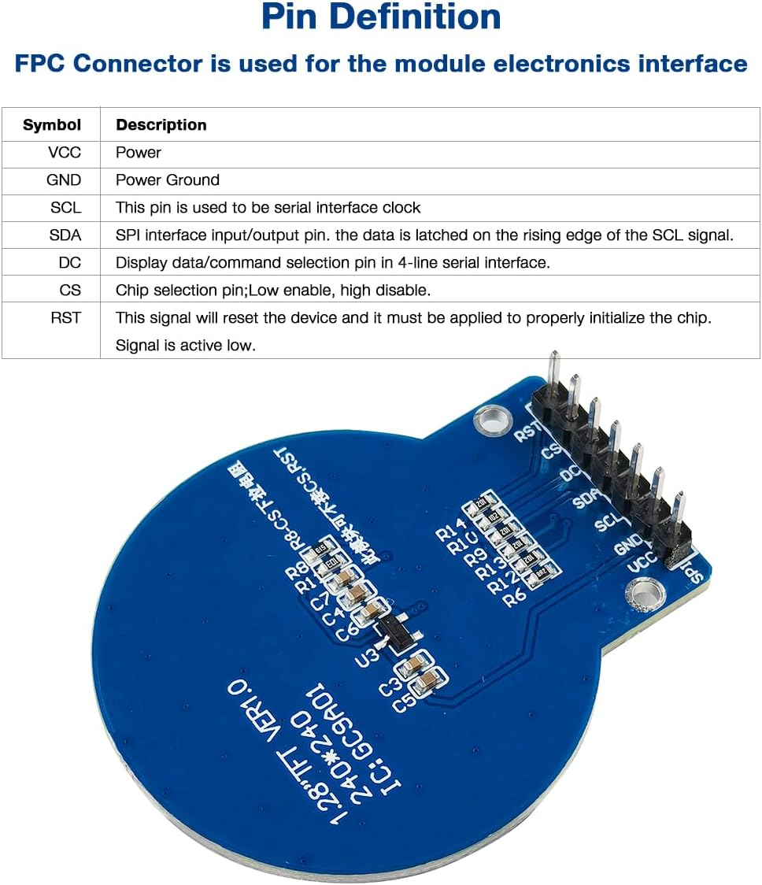

# P05: GC9A01 display interface

**Document state: Draft.** This page maps the vendor-image header for the selected Hosyond 1.28-inch round TFT and records the electrical checks needed for one display on either ESP32-S3 controller. Actual module identity, supply compatibility and operation remain unverified. The [gauge electronics record](../components/gauge-electronics/README.md) owns procurement and display-selection decisions.

## Module identity and orientation

The purchased listing identifies a GC9A01, 240 x 240 pixel, 4-wire SPI display. The supplied rear-board image is marked `1.28" TFT VER1.0`, `240*240`, and `IC: GC9A01`. These are **Vendor Listing** references, not an inspection of the received boards or proof of their revision.

View the **screen side**, with the connector tab at the bottom and its two mounting holes beside the header row. Read left to right: `RST CS DC SDA SCL GND VCC`. The positions below are documentation coordinates, not manufacturer pin numbers. A rear view reverses the left-to-right order when the tab remains at the bottom; follow the printed labels rather than the image angle.

The reference depicts a seven-position through-hole header. Connector part number, pitch, installed header orientation and mating connector remain TBD. The pin-reference image's generic FPC wording does not identify the external header or make the panel flex connector interchangeable with it.

## Header map

Directions are relative to the display. Order and functions have **Vendor Listing** evidence from the [front image](../../media/reference/gauge-electronics/gc9a01-display.jpg) and [pin-reference image](../../media/reference/gauge-electronics/gc9a01-pin-definition.jpg); no connection is bench verified. All control signals are intended to originate from the ESP32-S3's 3.3 V logic domain, subject to module compatibility checks.

| Front-view position, left to right | Label | Function | Direction | Domain / project use |
| --- | --- | --- | --- | --- |
| 1 | RST | Reset, active low per vendor | Input | 3.3 V logic planned; dedicated GPIO candidate, timing and startup state TBD |
| 2 | CS | Chip select, low enabled / high disabled per vendor | Input | 3.3 V logic planned; GPIO TBD |
| 3 | DC | Data/command selection | Input | 3.3 V logic planned; GPIO TBD |
| 4 | SDA | SPI serial data | Input for planned writes; vendor describes input/output | Controller MOSI candidate; readback support and bidirectional handling unverified |
| 5 | SCL | SPI serial clock | Input | Controller SPI clock candidate; mode and clock rate TBD |
| 6 | GND | Power ground and signal reference | Return | Shared display/controller reference; harness routing TBD |
| 7 | VCC | Module power | Power input | Supply voltage, tolerance and current TBD |

`SDA` and `SCL` are SPI labels on this module. They are not connections to the ADS1115 I2C bus. No separate MISO pin is pictured. The initial design needs display writes; do not assume that driver readback is available or connect another GPIO as MISO without a verified interface design. The vendor describes data latching on the rising clock edge, but this alone does not settle the complete SPI mode or maximum clock rate.

## Power and backlight

[A02: power architecture](../architecture/power-system.md) selects the controller's `3V3` rail for compatible peripherals. Display compatibility remains open: the supplied VCC description states only power, with no voltage range. Neither the GC9A01 name nor a visible board component establishes the breakout's supply rating, regulator circuit, logic thresholds or 5 V tolerance. Obtain documentation for the actual module and verify its circuitry before selecting VCC or applying power.

No separate `BL`, `BLK` or LED-control terminal appears in the seven-position reference. Backlight supply, current limiting and any brightness-control capability remain unknown. Do not allocate a backlight GPIO, drive VCC from a GPIO, or assume the display driver can dim this module. If dimming becomes a requirement, first identify supported control or an appropriate external circuit and account for its pin/current needs.

Include the display and backlight load in the selected controller's regulator budget if VCC is supplied from `3V3`; the current budget remains pending in [P01](esp32-s3-devkit.md) and [P02](xiao-esp32s3.md). Resolve power sequencing and signal states when either the controller or display is unpowered. Document supply and ground routing in the harness after voltage and current requirements are known.

## Controller allocation and bring-up

The initial interface budgets **five controller signals**: SCL, SDA, DC, CS and RST. This matches the display allocation considered in [P02: XIAO](xiao-esp32s3.md). All project GPIO assignments remain TBD; board aliases and default SPI pins are candidates, not completed wiring. Do not remove reset or chip-select control based on generic module examples without checking this board and its startup behavior.

Select the driver/library and initialization sequence for the verified module, then establish reset timing, DC polarity, SPI mode/rate, pixel format, color order, inversion and rotation through documented bring-up. No library, firmware or timing values are selected by this page. The advertised 240 x 240 frame describes a circular viewing area; evaluate clipping and text placement on the actual display.

Use [A03: measurement chain](../architecture/measurement-system.md) and the [firmware requirements](../../firmware/README.md) to keep rendering separate from acquisition and peak capture. A responsive screen alone does not establish measurement cadence. Test signed live pressure, min/max, units and invalid/stale indication, then evaluate driver-seat readability before finalizing the display or enclosure.

Exact connector IDs, GPIO destinations and wire specifications belong in W01 or W03 when created through the [inventory](../DIAGRAMS.md). Multiple displays and a larger panel remain future options, not requirements of this interface.

## Verification before harness design

- [ ] Compare received module markings, PCB outline and header labels with both vendor images; record actual revision and connector orientation.
- [ ] Obtain applicable module power/logic specifications and confirm VCC, ground, input compatibility and any onboard regulation or level shifting.
- [ ] Identify backlight circuitry and measure display current in a suitable documented bench setup; resolve supply capacity and any dimming requirement.
- [ ] Select GPIOs and verify CS, DC and reset behavior, startup states, power sequencing and SPI configuration.
- [ ] Verify initialization, test patterns, color/rotation, circular clipping and readability; record module, driver version and configuration with results.
- [ ] Link the resulting harness and measured results. Check acquisition/peak behavior while the display refreshes before treating the gauge as validated.

## Source reference

The public [display image](../../media/reference/gauge-electronics/gc9a01-display.jpg) and [pin-definition image](../../media/reference/gauge-electronics/gc9a01-pin-definition.jpg) are the interface evidence available here. Their [import record](../components/gauge-electronics/README.md#import-record---2026-10-06) preserves provenance and limitations. No schematic or manufacturer electrical specification for the exact purchased module is currently recorded.
