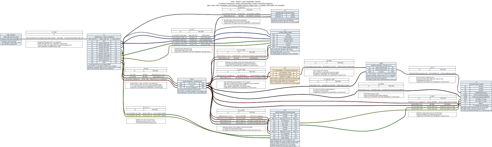
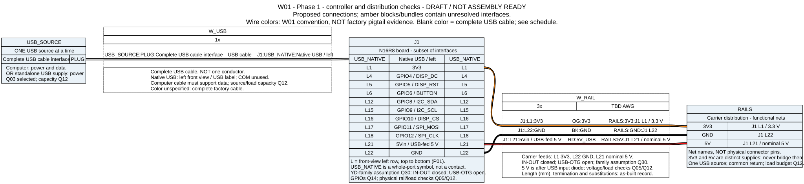
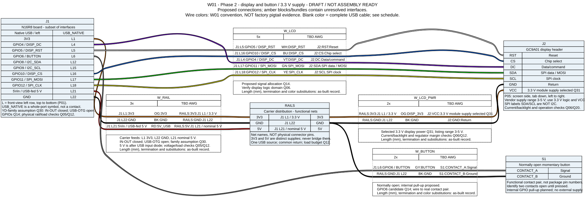
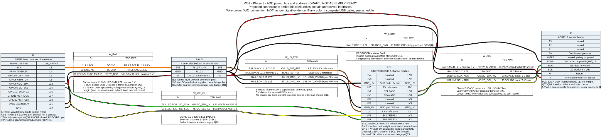
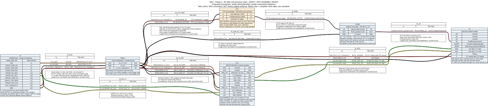

# W01: N16R8 bench harness

**Document state: Draft. Not assembly-ready.** W01 covers the complete intended bench gauge: one N16R8 controller, one GC9A01 display, one ADS1115, the FTP sensor and built RC input filter, a bidirectional I2C translator, one multifunction button, and USB-derived power distribution. The controller has not arrived and no connections have been bench verified. The XIAO and vehicle converter configurations remain separate work.

The design establishes intended signal and power wiring from listing/reference evidence, with hardware validation and remaining sensor interfaces explicit. Assemble and energize a section only after its listed prerequisites are resolved. P04 supplies the working sensor cavity map. Native USB, IN-OUT closed, USB-OTG open, the L21 nominal 5 V takeoff and 3.3 V display supply are selected (Q30/Q31). Rail/load checks, translator bring-up and filter power/protection review remain assembly checks.

## Drawing and authoritative source



Open the [full SVG](generated/bench-harness.svg) to zoom. The smaller phase views below are derived from the same source. Use the [generated connection schedule and controller assignment table](generated/connections.md) for readable endpoints and wire identities.

- **Connectivity source:** [bench-harness.yml](bench-harness.yml). Edit connections here, then regenerate; do not edit generated drawings or the schedule.
- **Source identity and tools:** [generation record](generated/generation.md).
- **Follow-up:** [open questions](../../../docs/open-questions.md), especially Q04-Q10, Q12, Q14, Q17, Q18 and Q29.

All drawn connections are planned or proposed. Blue module blocks identify interfaces from P01/P03/P05; amber blocks or bundles contain unresolved functional boundaries. Wire colors follow the [W01 color convention](generated/connections.md#wire-color-convention): black for ground, red for 5 V, orange for 3.3 V, and separate signal colors. The complete USB cable has no conductor color assignment and renders neutrally; it does not denote ground. Display VCC is orange for its selected 3.3 V rail. The full drawing is a design-review view, not an assembly-ready rendering. Blank/unconnected terminals are intentional where explained below.

### Endpoint and orientation conventions

| Identifier | Meaning and view | Evidence / limitation |
| --- | --- | --- |
| J1 | N16R8 board; `L1` etc. are left-row coordinates from the component side, antenna up and USB down | [P01](../../pinouts/esp32-s3-devkit.md). Only relevant interfaces are displayed; these are documentation coordinates, not manufacturer connector numbers. USB is a whole-port symbol, not a contact. Q04/Q05 remain open |
| J2 | Display header; screen side, connector tab down; labels read left to right | [P05](../../pinouts/gc9a01.md): 3.3 V VCC/logic selected Q31; current/backlight and operation Q06/Q20 |
| J3 | ADC header; back side, mounting holes up; labels read left to right | [P03](../../pinouts/ads1115.md). Module identity and pull-up/bias checks Q07/Q08 |
| S1 | Normally open button; `CONTACT_A/B` identify opposite electrical contacts | Physical terminal numbering not selected. On a multi-leg switch, identify which legs are internally common before wiring |
| RAILS | Functional distribution nets on the carrier | Not a purchased connector or pad-order drawing. Each named net is separate; repeated appearances of GND denote the same reference |
| FTP | Sensor/pigtail assembly, using the pigtail mating face with latch up: A/B/C left to right | [P04](../../pinouts/ftp-sensor.md) adopts the GM-family map: A ground, B signal, C 5 V. Working assumption for the listed replacement; Q09 retains as-built lead/fit check, Q10 calibration. Sensor mating face mirrors this view |
| LS1 | hiBCTR BSS138 module; solder/back side with HV row above LV row | [Component terminal reference](../../components/i2c-level-shifter/README.md). Channel 1 SDA, channel 2 SCL; GND_HV/GND_LV alias the two GND pads. Q28 selected; bring-up Q29 |
| COND | Built RC input filter: IN/OUT/GND electrical nodes | [Internal circuit and assembly](../../components/rc-input-filter/README.md): R1=470 ohm between IN/OUT; C1=1 uF nonpolar between OUT/GND. Node labels are not connector pin numbers. Q17 validation/power review remains |
| USB_SOURCE / W_USB | One external USB source and a complete factory cable | Computer power/data or standalone power, one at a time. The single graphic line represents the cable, not one conductor or a USB contact map |

Wire bundles group related connections for documentation. They do not require jacketed cables or a particular removable connector. Their conductor numbers are stable wire identities, not pigtail cavity numbers. Follow the [construction policy](../README.md#bench-construction-and-retention): on-hand nominal 2.54 mm protoboard/header stock, firm retention and strain relief, with soldered or removable terminations at assembler discretion. Record each chosen connector's actual mating view and mapping in the as-built record.

## Proposed signal allocation

The [generated controller table](generated/connections.md#proposed-controller-assignments) is derived directly from J1 in the YAML. Q14 contains a concrete proposal now, rather than an empty pin plan. It remains subject to matching the actual carrier and checking onboard uses under Q04/Q05; no firmware pin configuration has been implemented.

The allocation groups display signals and I2C on the board's left header. It leaves GPIO0/3/45/46 boot-related pins, GPIO35-37 memory connections, GPIO19/20 native USB, GPIO43/44 UART, GPIO39-42 JTAG and provisional GPIO48 RGB use out of gauge wiring. Reserve the unused exposed pins instead of connecting them by default. These restrictions come from P01 and its linked manufacturer references; a header label alone does not prove a pin is available on the actual carrier.

The button uses an internal GPIO pull-up with a normally open contact to GND. No button supply wire is required by this proposed interface. Validate pull-up/noise behavior for the assembled lead length. Preserve the [selected BetterButton interactions](../../../firmware/README.md#multifunction-button), including the separate zero-confirmation state. No backlight-control GPIO or display readback wire is assigned.

### ADC bring-up candidate

The 5 V supply and +/-6.144 V gain are selected. Other settings below remain Q18 candidates; none are recorded working settings:

| Setting | Proposal | Reason / prerequisite |
| --- | --- | --- |
| Channel | A0 single-ended to GND | One pressure channel; sensor output first passes through COND |
| Address | ADDR to GND, 7-bit `0x48` | Simple single-module address. Verify existing board bias before fitting W_ADDR; do not short an existing VDD strap |
| Gain range | **Selected: +/-6.144 V** | Covers the unscaled nominal 0-5 V envelope; 187.5 uV/count. Actual input must stay within GND to ADC VDD |
| Conversion | Single-shot, 128 SPS conversion setting | Poll completion/status, read one completed result, then request the next. Avoid counting repeated reads as new samples; effective acquisition rate includes software and bus overhead |
| Bus | Initial 100 kHz I2C | Bring-up candidate through LS1; verify separate 3.3 V and 5 V pull-up domains and communication |
| Readiness | Poll over I2C; ALERT unconnected | Saves one GPIO and provides explicit conversion completion in single-shot mode. Disable unused comparator/ALERT function |

Sources: [preserved TI datasheet](../../datasheets/ads1115-datasheet.pdf), sections 7.3.3, 7.4.2, 7.5.1 and Config register Table 8-3; [ADC component notes](../../components/adc/README.md). The existing 100-200 samples/s goal is not guaranteed by a nominal 128 SPS setting. Measure effective cadence with display/button activity and adjust Q18 if needed.

J3 A1-A3 are unused and externally unconnected in this draft; final unused-input treatment remains part of Q07/Q17. ALERT is intentionally unused for the polling proposal. Module decoupling and bus pull-ups must be checked under Q08; the absence of external resistor symbols is not a claim that pull-ups are unnecessary.

## Selected power and remaining checks

The [board power plan](../../components/esp32-s3-dev-board/power-plan.md) owns the internal USB/jumper explanation. W01 selects the native USB port (left in P01's front view), IN-OUT closed and USB-OTG open. W_RAIL conductor 3 connects J1 L21 / 5Vin to RAILS.5V. The sensor, ADC and translator HV share that nominal USB-fed rail. W_RAIL conductor 1 connects J1 L1 to RAILS.3V3, which supplies the display and translator LV. The native input diode remains in circuit; 5V is a nominal net name, not a precision 5.000 V guarantee.

The display listing specifies 3-5 V module power. Q31 selects 3.3 V VCC and direct 3.3 V logic. No display supply boundary is left deliberately unfed. RAILS contains only 3V3, 5V and GND; never bridge the two supply domains.

| Selected interface | Remaining assembly/bring-up check | Question |
| --- | --- | --- |
| J1 native USB; COM unused | Normal board/reference comparison, native programming/console/debug setup and startup without a host | [Q04/Q05](../../../docs/open-questions.md) |
| J1 L1 to RAILS.3V3; display and LS1 LV | Check rail voltage and usable regulator margin with display activity | [Q06/Q12](../../../docs/open-questions.md) |
| J1 L21 to RAILS.5V with IN-OUT closed | Check nominal USB-fed voltage after diode/cable drop and source/load margin; USB-OTG stays open | [Q05/Q10/Q12](../../../docs/open-questions.md) |
| LS1 LV/HV | Account for fitted pull-ups and verify bus/power behavior | [Q29](../../../docs/open-questions.md) |
| J3 power, bus and ADDR | Check header, pull-ups and existing address bias during bring-up | [Q07/Q08/Q18](../../../docs/open-questions.md) |
| FTP A/B/C | Use P04's sourced working map; check lead continuity/fit at assembly and calibrate | [Q09/Q10](../../../docs/open-questions.md) |
| COND IN/OUT/GND | Record stock parts; check node wiring, DC levels and power behavior | [Q17](../../../docs/open-questions.md) |

These are documented working assumptions and normal phased checks, not a requirement for additional photographs or independent authentication before designing the harness. Concrete discrepancies require correcting the affected connection.

Q03 selects one computer USB source or one standalone USB supply. Disconnect before changing and restart. No simultaneous USB sources, external header injection, converter/host combination or automatic switchover is included in W01. Source/load capability remains Q12; see [A02](../../architecture/power-system.md).

RAILS.GND is the proposed common electrical reference for the controller, display, ADC, translator, button, sensor return and conditioning. Its symbol does not require a particular terminal strip or chassis bond. Keep the sensor/conditioning/ADC reference path short and avoid using a display power-return conductor as the sole return for the analog section. Actual pad layout and branch routing belong in the build record; confirm common references and powered/unpowered signal behavior before use.

The [electrical review](../../components/adc/conditioning-review.md) selects a shared 5 V sensor/ADC branch and no analog divider. LS1 separates the controller's 3.3 V I2C from the ADC's 5 V I2C: at 5 V VDD, the ADC requires at least 3.5 V for a guaranteed logic high. COND implements the initial 470 ohm / 1 uF RC filter; stock-part recording, response and power/protection review remain Q17; LS1 uses the selected hiBCTR BSS138 module; physical pull-up/bus checks remain Q29. Further circuit documentation can remain nearby or use S01 if its complexity warrants a schematic.

### Wire and construction requirements

- Wire gauge is explicitly **TBD AWG** pending the actual current budget, length/voltage drop, insulation needs and connector fit. W01 is not a numeric wire-sizing specification yet. Record lengths in mm and the final gauge in AWG or mm2 before assembly release.
- Use the planned colors in the [generated schedule and legend](generated/connections.md#wire-color-convention) for added harness wiring. Label each wire by bundle/conductor or net identity; clock and data colors repeat across the separate SPI/I2C bundles. If available stock requires a substitution, identify both ends and record the actual color in the as-built record. Red and orange distinguish the two supply domains. Display VCC uses orange for the selected 3.3 V rail. Purchased pigtail colors remain evidence to record separately, never a basis for assigning sensor terminals.
- USB uses an appropriate factory data cable for computer operation; W_USB is not a cable-fabrication specification. Confirm the selected standalone source/cable can supply the verified load.
- Internal carrier wiring may be soldered; off-board leads may be soldered or use secure removable connectors. Record connectors, splice locations, pad/track cuts and bridges, and test points. Keep exposed conductors insulated and module insertion aligned.
- No shield or chassis connection is selected for this bench design. If noise or cable length requires one, document its termination and update the source instead of adding an undocumented ground path.
- Secure modules and cables independently of fragile signal contacts. Record and inspect strain relief; movement of the completed assembly must not produce intermittent connections.

## Phased assembly and verification

These are planned steps with prerequisites, not completed test results. All wiring changes occur with power disconnected. At each phase, record the actual configuration, supply conditions, instrument and readings using the [data conventions](../../../data/README.md). Retain only verified preceding connections; do not attach later-phase loads to unverified rails.

### Phase 0: identify and prepare

Match the received controller and selected modules to P01/P03/P04/P05. Record orientations and resolve each terminal used in the phase. Check protoboard pad connectivity and socket spacing, and plan support/strain relief. Inspect solder bridges, unintended rail shorts and wire identity before inserting modules. Compare continuity to the generated connection schedule, not a mirrored back-side view.

### Phase 1: controller and distribution



**Prerequisites:** Q04/Q05 for the selected port and board paths; define the intended source/current limit and Q12 rail limits. Keep peripherals disconnected.

With power disconnected, follow the [selected jumper plan](../../components/esp32-s3-dev-board/power-plan.md): close IN-OUT if open and leave USB-OTG open. Check the intended bridge and rail shorts. Connect one source to native USB; verify controller startup and programming/console behavior. Measure 3V3 and 5Vin against GND before adding loads, then connect W_RAIL using its documented polarity. Record actual diode/cable drop, source/current limit and any heating. No second USB port or external header supply is attached.

**Proceed when:** the controller works in the selected mode, polarity and rails are documented, and there is a supported load budget for the next phase. A stable unloaded rail alone does not prove full-load capacity.

### Phase 2: display and button



**Prerequisites:** Q06/Q12 supply and logic compatibility, Q14 actual-board pin checks, and a chosen display initialization for Q20. The diagram selects RAILS.3V3 to display VCC; use the listed 3-5 V range as the working module supply basis.

With power off, install the display and button connections. Verify the button contact pair is open at rest and closes when pressed. After power-up, verify the input changes between the planned idle and pressed levels, and test display orientation, colors, clipping and signed text. Measure supply voltage/current with display activity. Test the chosen gestures without applying calibration changes to an uncalibrated sensor; verify prompt actions do not also trigger normal-view peak reset.

**Proceed when:** stable display/button operation and current measurements support adding the ADC. Once gauge firmware exists, this test must also show that rendering and gesture handling do not block acquisition.

### Phase 3: ADC without sensor



**Prerequisites:** Q07/Q08 module and bus/strap checks, Q05/Q12 shared 5 V source/margin, selected LS1 terminal mapping and Q29 bring-up checks and Q18 configuration review. Sensor and COND remain disconnected.

Inspect existing pull-ups and ADDR bias before installing W_ADDR. Connect ADC power to the shared 5 V branch and LS1 references to their respective rails. Verify each bus segment's idle voltage before attaching the controller: 3.3 V on LV, 5 V on HV. Check address response and register configuration through LS1. An address scan alone does not authenticate the chip. Use a separately documented known-voltage fixture, referenced to the same ground and within verified ADC limits, to check fresh conversions and gain scaling. Record temporary connections; use an independent known voltage for this check rather than treating the uncalibrated sensor as a voltage standard.

**Proceed when:** measured conversions, timing and rail behavior agree with the configured device, including during display activity. Inputs used for a test must have defined values; an unconnected input is not a zero-voltage reference.

### Phase 4: conditioning and sensor



**Prerequisites:** P04 working terminal map and Q09 as-built lead/fit check, Q10 applicable pressure limits, Q17 recorded filter parts and circuit/power review, selected LS1 translator and Q29 bus checks and verified shared 5 V distribution. The COND block now links to a concrete internal circuit; remaining load and interface checks still prevent treating the complete harness as electrically validated.

Build R1/C1 using the [component assembly steps](../../components/rc-input-filter/README.md#building-from-existing-inventory). Check IN-to-OUT resistance, capacitor connection and actual parts. Validate the filter with a suitable stimulus and documented limits, including the intended power sequence. A multimeter can check DC levels but does not establish millisecond response or high-frequency attenuation. Check ADC-node voltage before attaching A0. With power off, connect the verified pigtail/circuit and then measure sensor supply, sensor output and ADC input at atmosphere. Follow the [sensor calibration procedure](../../../docs/testing/test-plan.md) within verified pressure limits. Confirm sign, zero, slope, repeatability, validity handling and peaks using the complete assembled chain.

**Proceed when:** the chain has a traceable calibration and no unexplained saturation, drift or power-sequence behavior. Selecting an unscaled input does not establish calibration or fault protection.

### Phase 5: complete bench operation

Use the full diagram and selected firmware configuration. Check combined startup/operating load and rail stability, acquisition cadence under rendering, button actions and invalid/stale indication. Confirm source changes by unplugging, reconnecting the standalone supply and restarting without a computer. Firmware must not wait indefinitely for a host. Verify connector retention and continuity after normal handling. Test persistent settings only when that feature exists; no firmware is implemented by W01.

Promote the documented connections to assembly-ready only as their evidence is recorded. Bench success does not validate the XIAO power path, vehicle transients or W05 installation.

## Rendering and validation

Tested with Python 3.12.10, WireViz 0.4.1 and Graphviz 16.1.0. The [pinned Python requirements](requirements.txt) are drawing tools, not firmware dependencies. Install [Graphviz](https://graphviz.org/download/) separately and put `dot` on PATH; the Python graphviz package does not supply that executable. See [WireViz documentation](https://github.com/wireviz/WireViz) for its native format and CLI.

From the repository root, an isolated environment can be used without a global installation:

```powershell
python -m venv _staging/work/w01/tools/venv
& _staging/work/w01/tools/venv/Scripts/python.exe -m pip install -r hardware/wiring/bench/requirements.txt
# After adding the installed Graphviz bin directory to PATH:
& _staging/work/w01/tools/venv/Scripts/python.exe hardware/wiring/bench/render.py --preview-dir _staging/work/w01/previews
```

`render.py` validates terminal references, conductor coverage and view selection, then produces the full SVG, four section SVGs, a connection schedule and a source/tool record. The optional PNG previews stay private. View membership lives in `x-w01-views` within the authoritative YAML; the renderer never overrides connectivity. Native WireViz can render the full source directly:

```powershell
wireviz -f s -o hardware/wiring/bench/generated hardware/wiring/bench/bench-harness.yml
```

Use `render.py` after source changes so sectional views and the schedule are refreshed together. Native BOM output is not published: functional TBD blocks are not orderable parts, and missing lengths/gauges would make that output unsuitable as a construction BOM. The [procurement BOM](../../bom/parts.md) remains separate.

The full view and four section views were rendered and visually inspected. Terminal references and conductor coverage passed the renderer's checks. These checks validate document generation, not electrical operation; no physical bench results are recorded.
