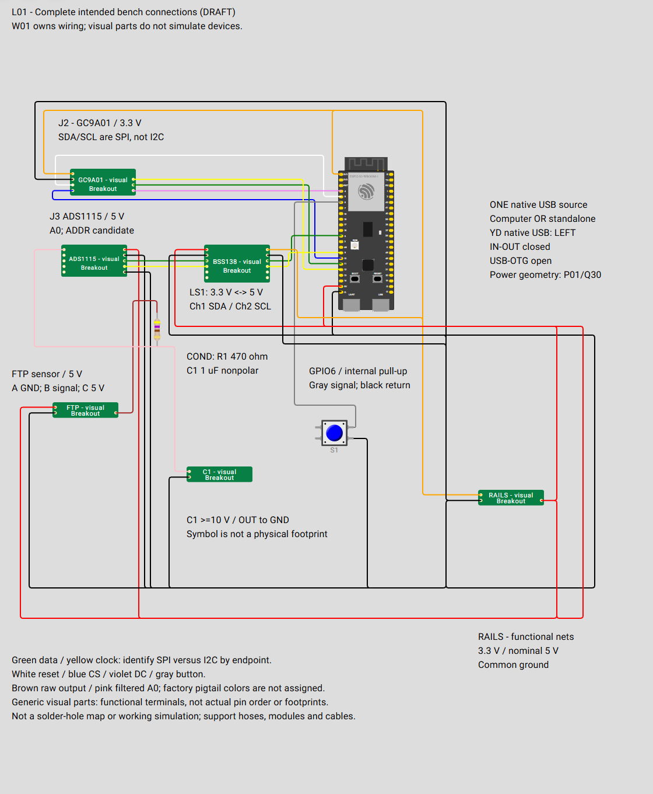

# Wokwi bench illustration and simulation

**L01 state: Draft; complete intended bench connectivity, not assembly-ready.** [diagram.json](diagram.json) illustrates the controller substitute, display, ADS1115, BSS138 translator, FTP sensor, built RC filter, button and supply distribution. The [W01 harness](../../hardware/wiring/bench/README.md) owns the electrical design; [interface-map.json](interface-map.json) maps its terminals into this view. The complete USB cable is annotated because the virtual board has no matching cable endpoint.

See the [adoption decision](../../docs/wokwi-adoption.md), [standard](../../docs/diagramming-and-wiring-standard.md) and [inventory](../../hardware/DIAGRAMS.md). No gauge firmware or functioning peripheral models are included. Construction remains solderable protoboard with secure connections, removable modules and mechanical support.



Open the [full PNG](diagram-preview.png) to zoom. This is a generated preview of [diagram.json](diagram.json), not an additional wiring source.

## Read the connections

**FTP.B** carries the raw sensor output through the brown lead to **R1**, the selected 470 ohm series resistor. The other lead is **COND.OUT**, the pink node shared by ADC **A0** and **C1**. C1 is the selected 1 uF nonpolar capacitor from OUT to ground. This shows the [RC filter](../../hardware/components/rc-input-filter/README.md)'s series/shunt topology; there is no divider or simulated filter response. The pink R1-to-C1 connection represents an internal node, not another required harness cable.

ADC and sensor share nominal **5 V**. ADC SDA/SCL connect through **LS1.HV1/HV2** to **LV1/LV2**, then controller GPIO8/9 at **3.3 V**. LV/HV supply references stay separate; both translator ground pads join common return. Channels 3/4 are unused. See the [translator](../../hardware/components/i2c-level-shifter/README.md) and [ADC interface](../../hardware/pinouts/ads1115.md).

Display VCC is **3.3 V**, with W01's five SPI/control wires. Display SDA/SCL mean SPI data/clock, not the ADC I2C bus. No MISO or backlight wire is added. ADC ADDR-to-GND is a candidate under Q08/Q18; A1-A3, ALERT and unused translator channels remain unconnected.

**S1** connects GPIO6 to ground when pressed. Planned firmware enables the internal pull-up: released HIGH, pressed LOW. The generic switch's `1.l`/`1.r` legs are internally common, as are `2.l`/`2.r`; the drawing uses opposite contacts `1.r` and `2.r`. No button supply is needed. See [button requirements](../../firmware/README.md#multifunction-button).

Colors follow [W01](../../hardware/wiring/bench/generated/connections.md#wire-color-convention): black ground, red nominal 5 V, orange 3.3 V, green data, yellow clock, white reset, blue CS, violet DC, gray button, brown raw analog and pink filtered A0. Endpoints distinguish SPI from I2C. These describe added wiring, not factory pigtail colors.

## Representation and mapping

J1 is Wokwi's ESP32-S3-DevKitC-1 using its [official definition](https://github.com/wokwi/wokwi-boards/blob/main/boards/esp32-s3-devkitc-1/board.json), substituting for the purchased YD-style N16R8. Attributes approximate 16 MB flash / 8 MB octal PSRAM and select native USB serial; GPIO19/20 stay reserved.

**Virtual header positions, footprint, USB ports and power paths differ.** Follow [P01](../../hardware/pinouts/esp32-s3-devkit.md) and [the power plan](../../hardware/components/esp32-s3-dev-board/power-plan.md). W01 selects one source at native USB, IN-OUT closed, USB-OTG open, and L21 nominal 5 V distribution. Native USB is left on the purchased board's front view. The virtual 5V terminal only illustrates that functional feed; it does not validate jumpers, diode drop or current capacity.

| Part | Representation |
| --- | --- |
| J1 | Native board GPIO functions; supply aliases `3V3.1`, `GND.1`, `5V` |
| J2 / J3 | Original GC9A01 / ADS1115 visual parts with all module terminal names |
| LS1 | Original BSS138 visual part with all channel/reference names and both ground aliases |
| FTP | Original visual part; A/B/C functions from the adopted [P04 map](../../hardware/pinouts/ftp-sensor.md) |
| RAILS | Separate functional 3V3, GND and 5V nodes, not a purchased terminal block |
| R1 | Native 470 ohm resistor; pin 1=COND.IN, pin 2=COND.OUT |
| C1 | Original visual part; OUT/GND are node aliases on a nonpolar capacitor, not polarity |
| S1 | Generic normally open button; opposite contacts map CONTACT_A/B |

Custom symbols use generic breakout presentation. **Leg order/package shape do not reproduce actual connector order or footprints.** Use hardware pinout/component references to identify real terminals. Exact aliases are in [interface-map.json](interface-map.json), checked against W01.

## Open online

1. Open a [new ESP32-S3 project](https://wokwi.com/projects/new/esp32-s3).
2. For each of the six names in the [visual-parts guide](chips/README.md), click **+**, select **Custom Chip**, enter the exact name, choose C and click **Create Chip**.
3. Replace the created `.chip.json` and `.chip.c` contents with the matching repository files. Online filenames are flat; repository files are grouped under `chips/`. Move or remove the automatically added instances as you go so they do not cover the editor toolbar; the final JSON restores them in their intended positions.
4. Finally replace `diagram.json` with [this source](diagram.json), removing the temporary instances and restoring the maintained view.
5. Hover over endpoints for labels. Use **F** with the diagram focused or the **Fit** menu, then zoom/pan as needed. See [editor controls](https://docs.wokwi.com/guides/diagram-editor).

Viewing needs no simulation run or chip compilation. Saving online is optional; Git holds the source. The template sketch is unrelated example code. The original C stubs only print an illustration notice when initialized; they implement no device behavior or gauge firmware.

## VS Code and future simulation

Use the **Wokwi Simulator** extension's [setup guide](https://docs.wokwi.com/vscode/getting-started). [Editor plans](https://docs.wokwi.com/vscode/diagram-editor) currently allow viewing/text editing on Community/Hobby; graphical editing requires Hobby+ or Pro. Keep credentials local.

**Expanded custom parts require registration in VS Code.** JSON alone may show missing chips and omit wires. [Custom-chip configuration](https://docs.wokwi.com/vscode/project-config#custom-chips) needs compiled `.chip.wasm`, adjacent definitions and `[[chip]]` entries, not yet provided. Use the online workflow for the complete editable illustration.

No active `wokwi.toml` or firmware build exists. When firmware is introduced, place its Wokwi configuration beside the diagram, reference actual firmware/ELF outputs under `firmware/`, and use **Wokwi: Select Config File** for this subfolder. Follow the [configuration](https://docs.wokwi.com/vscode/project-config) and [PlatformIO](https://docs.wokwi.com/vscode/platformio) guides; keep generated binaries local.

## Model coverage and next work

Native controller/button representations are supported, but have no project firmware to run. ADS1115, GC9A01, translator, sensor, distribution and C1 are **terminal-only visual parts**. They implement no conversion, SPI commands, translation, pressure output, internal pad joining, supply distribution or capacitance. R1's native simulation is [limited](https://docs.wokwi.com/parts/wokwi-resistor); RC response is not validated. USB behavior is annotated, and the vehicle converter/XIAO configuration remains outside this N16R8 view.

ADS1115/GC9A01 are absent from the documented [built-in list](https://docs.wokwi.com/getting-started/supported-hardware). A [community ADS1115 example](https://wokwi.com/projects/375022400134910977) was located, but its reuse license and coverage are not established; no code was imported. No GC9A01 candidate was established by this review. The [original definitions](chips/README.md) use the documented [custom format](https://docs.wokwi.com/chips-api/chip-json).

Future synthetic measurements can exercise shared calibration, validity, peaks, display and button logic. They do not test an ADC driver or I2C fault without the corresponding model/bus path. Keep acquisition separate from display smoothing and never automatically zero with the engine running. Add scenarios with useful content and describe what each tests. Physical rails/current, filter response, sensor calibration and retention still require actual tests.

## Check and maintain

### Refresh the PNG

[render-preview.mjs](render-preview.mjs) loads the source and six visual definitions into an unsaved online Wokwi project and captures only the diagram canvas in light mode. It does not save, share or start the simulation. The PNG contains no editor UI or template sketch. Node.js and Puppeteer are optional documentation tools; they are not firmware dependencies. Run from the repository root:

```powershell
npm install --prefix _staging/work/wokwi/tools puppeteer@25.12.0
node simulation/wokwi/render-preview.mjs
```

The renderer accepts an optional path to an existing npm tooling directory as its first argument. It needs internet access to Wokwi and may need adjustment if the online editor UI changes. Output is [diagram-preview.png](diagram-preview.png), captured at 1120 x 1360 pixels using Puppeteer 25.12.0 / Node.js 24.15.0. Inspect the image after regeneration and refresh it whenever diagram connections, labels, positions or custom visual definitions change. The crop removes surrounding editor controls without changing diagram content.

### Check connectivity

Reuse W01's [pinned Python tooling](../../hardware/wiring/bench/README.md#rendering-and-validation); this checker uses existing PyYAML, not a firmware dependency. From the repository root:

```powershell
& _staging/work/w01/tools/venv/Scripts/python.exe simulation/wokwi/check.py
```

[check.py](check.py) compares all harness endpoints/colors with W01, validates native/custom pins and unique IDs, and checks the internal R1/C1 connection. Only the annotated whole USB cable is omitted. After an authorized W01 change, refresh projected connections with:

```powershell
& _staging/work/w01/tools/venv/Scripts/python.exe simulation/wokwi/check.py --sync
```

Unchanged directed connections retain routes; changed wires may need routing. Update aliases when interfaces change, then inspect the full view and check documentation links/whitespace. Keep unrelated positions stable; do not change hardware decisions to fit virtual parts.

Validation used Python 3.12.10 and W01's existing PyYAML environment: 20 parts and 29 wires passed endpoint/color, unique-ID, native/custom pin and RC-topology checks. The six original definitions were loaded into an unsaved online Wokwi ESP32-S3 project and the complete view was rendered and visually inspected using Puppeteer 25.12.0 / Node.js 24.15.0. The editor reported no missing chips or diagnostics. Relative-link/case and Git whitespace checks passed. These checks establish documentation consistency/presentation; no chip compilation, gauge firmware execution, physical fit or measured performance was tested.
